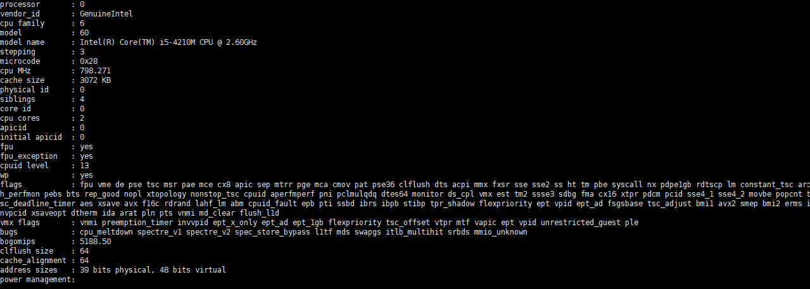

# 🔄동시성 제어 분석 보고서

목차
1. 동시성 문제란?
2. 동시성 문제 해결 방법
   1) 단일 서버에서 가능한 Lock  
      1) synchronized
      2) ReentrantLock
   2) 분산 서버에서 가능한 Lock
      3) 비관락(Pessimistic Lock)
      4) 낙관락(Optimistic Lock)
      5) 네임드락(Named Lock)
      6) Redis 분산락(Distributed Lock)
         1) Lettuce
         2) Redisson

3. 시나리오 별 동시성 제어
   1) 좌석 선점(예약)
      1) 비관락
      2) 낙관락
      3) 네임드락
      4) Redis 분산락
4. 결론

---

## 동시성 문제란?
공유자원에 대해 동시에 여러 개의 프로세스가 접근하여 생기는 경쟁 상황(race condition)을 우리는 동시성 문제라고도 하며,  
더 자세히는 동일한 하나의 데이터에 두 개 이상의 스레드, 혹은 세션에서 가변 데이터를 동시에 제어할 때 나타는 문제로,  
하나의 세션이 데이터를 수정 중일 때, 다른 세션에서 수정 전의 데이터를 조회해 로직을 처리함으로써 데이터의 정합성이 깨지는 문제를 말합니다.

실생활에서 쉬운 예를 들어보겠습니다.  
철수, 영희는 XX 드라이브에서 word 문서를 작업을 같이 하고 있습니다.
이때 철수가 출근을 조금 일찍해서 XX 드라이브에서 word 문서에 오늘 해야할 업무를 확인합니다. 문서를 열어서 작업을 시작합니다. (중간 중간 저장 안하고 작업하는 중) 
작업을 하고 있는 도중 영희가 출근해서 문서를 열었을 때 철수의 작업물이 확인 되지 않기 때문에 아무도 안한 작업이라 생각하고 작업을 시작합니다.
철수는 작업을 끝냈습니다.
영희도 작업을 끝냈습니다.

이렇게 되었을 때 일을 2번하는 행위가 될 수도 있고, 영희가 이후에 작업을 했기때문에 철수의 작업은 덮어씌워지게 됩니다. 즉, 철수의 작업물은 사라집니다.
이러한 문제를 제어하기 위해 철수가 문서를 열었을때 문서에 접근하지 못하도록 설정해 둔다면 이러한 문제를 원활히 해결할 수 있을 것 입니다.

---

## 동시성 문제 해결 방법
### 단일 서버에서 적합한 Lock
서버가 1대일시 동시성 문제 해결에 적합한 Lock입니다.  
`단일 서버에서만 적합한 이유?` A라는 서버와 B라는 서버 총 2대의 서버가 있다고 가정하겠습니다.  
A서버는 B서버의 존재를 B서버는 A서버의 존재를 알지 못합니다.  
따라서 A서버가 락을 사용하더라도 B서버는 A서버가 락을 사용하여 점유하지 못하게 했는지 알지 못합니다.
왜냐하면 서로 다른 JVM에서 동작하기 때문입니다. 

### 1. synchronized
Java에서 synchronized 키워드는 멀티스레딩 환경에서 동기화를 보장하기 위한 도구입니다.  
특정 코드 블록이나 메서드에 대해 한 번에 하나의 스레드만 접근할 수 있도록 락(Lock)을 사용하여 동시성 문제를 방지합니다.

`코드예제`
```java
@Service
@RequiredArgsConstructor
public class StockService {
 
    private final StockRepository stockRepository;
    
    /**
     * synchronized 사용시 @Transactional과 동시에 사용하면 안된다.
     * Synchronized를 사용하는 이유는 해당 메소드를 한 쓰레드에서만 돌리기 위해서다.
     * 하지만, 트랜잭션이 같이 정의가 되어있다면 첫 번째 쓰레드가 끝나기 전 두 번째 쓰레드가 발동할 수도 있다.
     */
    // 쓰레드 대기 지점
    public synchronized void decrease(Long id, Long quantity) {
        Stock stock = stockRepository.findById(id).orElseThrow();
        stock.decrease(quantity);
        stockRepository.saveAndFlush(stock);
    }
}
```

위와 같은 예시에서 2개 이상의 쓰레드가 동시에 decrease 메서드를 호출한다고 가정해보겠습니다.  
이때, 1번 쓰레드가 가장 먼저 decrease메서드를 호출했다고 가정하면 메서드가 끝날때까지 나머지 쓰레드는 대기 상태에 놓입니다.  
즉 위치상으로 말하자면, 나머지 쓰레드들은 `쓰레드 대기 지점`이라고 적힌 지점에서 대기하게 됩니다.  
이후 호출된 순서를 보장하지 않고, 1번 쓰레드가 메서드를 탈출한 시점부터 나머지 쓰레드 들이 진입하게 됩니다.

`장점`
- 구현이 간단하다.

`단점`
- 분산 서버에서 적합하지 않다. 즉, 단일 서버에서만 동시성 보장이 가능하다.


#### 결론
단일 서버에서만 사용가능하다는 치명적 단점으로 인해, 실무에서는 동시성 문제 해결방법으로 적합하지 않습니다.

---

### 2. ReentrantLock
JAVA 에서 동시에 여러 개의 스레드가 접근하는 것을 제어하기 위한 동기화 메커니즘 중 하나입니다.  
수동으로 잠금 영역(Lock) 의 시작점과 끝점을 설정할 수 있는 객체입니다.  
즉, 유연한 동기화를 제공합니다.

`코드예제`
```java
import java.util.concurrent.locks.ReentrantLock;

public class Example {
    private ReentrantLock lock = new ReentrantLock(true);

    public void performTask() {
        // 쓰레드 대기 지점
        lock.lock(); // 락 획득
        try {
            // 보호되어야 할 코드 영역
            // 임계 영역 (Critical Section)
        } finally {
            lock.unlock(); // 락 해제
        }
    }
}
```

위의 예제에서 2개 이상의 쓰레드가 동시에 performTask메서드를 호출한다고 가정해보겠습니다.  
이때, 1번 쓰레드가 가장 먼저 `lock.lock();` 지점에 왔다면, `lock.unlock();` 지점까지 다른 스레드들은 실행되지 못하고 대기 상태에 놓입니다.  
즉 위치상으로 말하자면, 나머지 쓰레드들은 `쓰레드 대기 지점`이라고 적힌 지점에서 대기하게 됩니다.  
`synchronized` 와 다른 점은 `new ReentrantLock(true);`에서 `true`로 적은 덕분에 먼저 접근한 스레드 호출 순서로 실행됩니다.(`new ReentrantLock();`로 적는다면 순서가 보장되지 않습니다.)

`장점` 
- synchronized에 비해 더욱 세밀하게 lock을 설정할 수 있다.
- 공정성을 보장할 수 있다.

`단점`
- 명시적 해제가 필요하다.(이로 인해 휴먼 에러가 발생할 수 있다.)
- 분산 서버에서 적합하지 않다. 즉, 단일 서버에서만 동시성 보장이 가능하다.

#### 결론
단일 서버에서만 사용가능하다는 치명적 단점으로 인해, 실무에서는 동시성 문제 해결방법으로 적합하지 않습니다.

---

### 분산 서버에서 적합한 Lock
서버가 2대 이상일시 동시성 문제 해결에 적합한 Lock입니다.

### 1. 비관락(Pessimistic Lock)
DateBase Lock을 이용하여 순차적인 접근으로 제어하는 방법입니다.  
- Pessimistic Lock이란 실제로 데이터에 Lock을 걸어서 정합성을 맞추는 방법입니다.
- Exclusive Lock(배타적 잠금)을 걸게 되면 다른 트랜잭션에서는 Lock 이 해제되기 전에 데이터를 가져갈 수 없게 됩니다.
- 자원 요청에 따른 동시성문제가 발생할 것이라고 예상하고 락을 걸어버리는 비관적 락 방식입니다.
- 하지만, Dead Lock(교착상태)에 빠질 위험성이 있으므로 유의해야 합니다.


`코드예제`
```java
public interface StockRepository extends JpaRepository<Stock, Long> {
 
    @Lock(value = LockModeType.PESSIMISTIC_WRITE)
    Optional<Stock> findById(Long id);
    
}
```

```java
@Service
@RequiredArgsConstructor
public class StockService {

   private final StockRepository stockRepository;

   @Transactional
   public void decrease(Long id, Long quantity) {
      Stock stock = stockRepository.findById(id).orElseThrow(); // Lock 실행 시점
      stock.decrease(quantity);
      stockRepository.saveAndFlush(stock);
   }
}
```

```java
 @Test
 @DisplayName("Pessimistic Lock(비관적 락) 사용")
 public void 동시에_100개_요청() throws InterruptedException {
     int threadCount = 100;
     ExecutorService executorService = Executors.newFixedThreadPool(32);
     CountDownLatch latch = new CountDownLatch(threadCount);

     for (int i = 0; i < threadCount; i++) {
         executorService.submit(() -> {
             try {
                 stockService.decrease(1L, 1L);
             } finally {
                 latch.countDown();
             }
         });
     }

     latch.await();
     Stock stock = stockRepository.findById(1L).orElseThrow();
     assertEquals(0L, stock.getQuantity());

 }
```

위 예제에서 `findById`에 위에 `@Lock(value = LockModeType.PESSIMISTIC_WRITE)` 을 두면 비관락을 사용할 수 있습니다.  
이렇게 비관락 어노테이션이 달린 findById 메서드를 사용하게 되면,  
`Lock 실행시점`의 line에서 동시에 접근된 스레드 중 가장 빠르게 도달한 스레드만 메서드 끝까지 실행되게 됩니다.  
조금 더 자세히 설명하자면, 10개의 스레드가 동시에 StockService의 decrease 메서드를 호출했다고 가정해보겠습니다.  
이때, 1번 스레드가 `Stock stock = stockRepository.findById(id).orElseThrow();`를 가장 먼저 호출했다고 가정하면 나머지 스레드는 해당 라인에서 대기상태로 놓입니다.  
9개의 스레드는 `stockRepository.saveAndFlush(stock);`라인에 도달하길 기다릴 것 입니다.  
1번 스레드가 메서드끝에 도달하여 탈출합니다.  
그러면 나머지 9개 스레드 중 1개의 스레드가 `Stock stock = stockRepository.findById(id).orElseThrow();`를 실행하고 나머지 8개의 스레드는 대기상태로 놓입니다.  
이러한 과정을 반복하기 때문에 동시성 문제가 생기지 않습니다.

> **이렇게 되면 단일 서버에서만 유효한 것 아닌가요?**

내용을 이해하기 쉽게 표현하다 보니, 위와 같이 설명했는데 조금 더 분산 서버 관점에서 설명하겠습니다.  
A서버, B서버, C서버가 있다고 가정하겠습니다.
3개의 서버 모두 동시에 StockService의 동일한 인자로 decrease를 실행했다고 가정하겠습니다.  
3개의 서버 모두 동시에 `Stock stock = stockRepository.findById(id).orElseThrow();`를 실행했다면  
3개의 서버 모두 동시에 Database에서 `SELECT * FROM stock WHERE id = 1 FOR UPDATE;` 라는 DML 실행됩니다.  
이 중 A서버가 가장 빨랐다면, A서버가 먼저 행잠금을 하게되고 작업을 하게됩니다.  
이때 B서버 C서버는 DB 스토리지 엔진에서 행잠금이 풀리기를 대기합니다.  
그러니까 정확히는 B서버, C서버는 Database안에서 대기하게 되는 형태입니다. `stock.decrease(quantity);`는 실행되지 않으면서요.  
그리고 A서버는 메서드가 끝나게 될때 비로소 B서버, C서버 중 하나의 서버가 해당 행에 접근할 수 있게 됩니다.

`장점`
- **데이터 정합성 보장**: 동시성 문제가 발생하기 쉬운 환경에서 데이터 충돌을 확실히 방지할 수 있음.
- **충돌 감지 및 처리 불필요**: 데이터 접근 시 잠금을 통해 충돌을 원천적으로 차단하므로, 충돌 후 롤백 로직을 따로 구현할 필요 없음.

`단점`
- **성능 저하**: 잠금이 걸리면서 다른 트랜잭션이 대기해야 하므로, 동시성이 높은 시스템에서 성능 병목 발생 가능.
- **데드락 위험**: 여러 트랜잭션이 서로 다른 자원을 잠근 상태에서 교착 상태(데드락)가 발생할 가능성이 있음.

#### 결론
데이터 베이스의 부하를 준다는 점과 대규모 시스템에서 데드락의 위험이 있다는 점에서 실무에서는 잘 사용되지 않습니다.

---

### 2. 낙관락(Pessimistic Lock)
Optimistic Lock은 실제 Lock을 사용하지 않고, 데이터의 Version을 이용하여 데이터의 정합성을 준수하는 방법입니다.
- 먼저 데이터를 조회한 후에 update를 수행할 때 현재 내가 조회한 버전이 맞는지 확인하며 업데이트합니다.
- 자원에 Lock을 걸어서 선점하지 않고, 동시성 문제가 발생하면 그때 가서 처리하는 낙관적 락 방식입니다.
- 내가 조회한 버전에서 수정사항이 생겼을 경우에는 application에서 다시 조회 후에 작업을 수행하는 롤백 작업을 수행해야 합니다.

`코드예제`
```java
public interface StockRepository extends JpaRepository<Stock, Long> {
 
    @Lock(value = LockModeType.OPTIMISTIC)
    Optional<Stock> findById(Long id);
    
}
```
```java
@Entity
@Getter
@NoArgsConstructor(access = AccessLevel.PROTECTED)
public class Stock {
 
    @Id
    @GeneratedValue(strategy = GenerationType.AUTO)
    private Long id;
    private Long productId;
    private Long quantity;
	
    // 버전 컬럼 추가!!
    @Version
    private Long version;
    
    public Stock(final Long id, final Long quantity) {
        this.id = id;
        this.quantity = quantity;
    }
 
    public void decrease(final Long quantity) {
        if (this.quantity - quantity < 0) {
            throw new RuntimeException("재고 부족");
        }
        this.quantity -= quantity;
    }
    
}
```
```java
@Service
@RequiredArgsConstructor
public class StockService {
 
    private final StockRepository stockRepository;
    
    @Transactional
    public void decrease(Long id, Long quantity) {
        Stock stock = stockRepository.findById(id).orElseThrow();
        stock.decrease(quantity);
        stockRepository.saveAndFlush(stock);
    }
    
}
```
```java
@Component
@RequiredArgsConstructor
public class OptimisticLockStockFacade {
 
    private final StockService stockService;
	
 	/**
 	* Lock을 잡지 않으므로, Pessimistic Lock(비관적 락)보다 성능상 이점이 있을 수 있다.
 	* 하지만, 업데이트가 실패했을 경우 재시도 로직이 개발자가 직접 작성을 해주어야 한다.
 	* 또한 충돌이 빈번하게 일어난다면, Pessimistic Lock이 성능상 이점이 더 있을 수 있다.
 	*/
    public void decrease(Long id, Long quantity) throws InterruptedException {
        while (true) {
            try {
                stockService.decrease(id, quantity);
                break;
            } catch (Exception e) {
                Thread.sleep(1);
            }
        }
    }
}
```


위에 코드에 맞춰 위 그림으로 설명하도록 하겠습니다.  
서버1, 서버2 모두 id가 1인 데이터의 quantity를 98로 변경하고 싶은 상황입니다.  
이때 서버 1, 서버 2 동시에 `update quantity = 98, version = version + 1 from stock where id = 1 and version = 1`이라는 구문을 실행합니다.  
이때 서버 1이 간발의 차이로 먼저 적용 되었습니다. 그렇다면 서버 2의 요청은 어떻게 될까요?  
version 1인 것을 찾아야 하는데 찾을 수 없게됩니다. 따라서 해당 요청은 Fail로 처리되고 개발자가 직접 이에대한 로직을 작성해야 합니다.  
코드상으로 확인하게 된다면 `OptimisticLockStockFacade` 클래스에서 decrease를 호출하게 되었을 때  
while문과 try-catch를 통해 처리해주는 원리와 같습니다.

> 재시도 로직을 개발자가 처리해주지 않는다면 어떻게 되나요?

10개의 요청이 동시 되었을때, 가장 먼처 온 요청만 처리되고 나머지는 모두 fail로 처리됩니다.  
9개의 요청도 처리가 되어야 했다면, 문제가 생길 수 있습니다.

`장점`
- **높은 동시성 지원**: 잠금을 사용하지 않으므로 다중 사용자 환경에서 성능이 뛰어나며, 병목 현상을 최소화할 수 있음.
- **데드락 방지**: 트랜잭션 간 잠금을 사용하지 않으므로 교착 상태(데드락)가 발생하지 않음.

`단점`
- **충돌 처리 비용 증가**: 충돌 발생 시 트랜잭션을 롤백하거나 재시도해야 하므로, 수정 요청이 많을 경우 성능 저하 및 복잡도 증가.
- **충돌 발생 가능성**: 데이터가 자주 수정되는 환경에서는 충돌 빈도가 높아질 수 있으며, 이는 성능 저하와 사용자 경험 악화로 이어질 수 있음.

#### 결론
동시성의 문제가 많을때 처리해줘야하는 로직이 증가하는 문제가 있기 때문에 실무에서는 잘 사용되지 않습니다.

---
### 3. 네임드락(Named Lock)
- Named Lock은 이름을 가진 Metadata Lock입니다.
- 이름을 가진 Lock을 획득한 후, 해지될 때까지 다른 세션은 이 Lock을 획득할 수 없게 됩니다.
- 주의할 점은, 트랜잭션이 종료될 때 Lock이 자동으로 해지되지 않기 때문에, 별도로 해지해주거나 선점시간이 끝나야 해지됩니다.
- Mysql에서는 getLock( )을 통해 획들 / releaseLock()으로 해지할 수 있습니다.


위의 도식도의 수행 과정은 다음과 같습니다.
Named Lock은 Stock에 락을 걸지 않고, 별도의 공간에 Lock을 건다.  
session-1 이 1이라는 이름으로 Lock을 건다면, session 1 이 1을 해지한 후에 Lock을 얻을 수 있다.  
주의할 점은 Named Lock을 활용할 때 데이터소스를 분리하지 않고, 하나로 사용하게 되면 connection pool이 부족해지는 현상이 발생해 Lock을 사용하지 않는 다른 서비스까지 영향을 끼칠 수 있다는 문제가 있습니다.  
Named Lock을 활용하면 분산 락을 구현할 수 있고, Pessmistic  Lock의 경우 타임아웃을 구현하기 까다롭지만, Named Lock은 손쉽게 구현할 수 있습니다. 하지만 트랜잭션 종료 시에 Lock 해제와 데이터 소스 분리 시 세션 관리를 수동으로 진행되어야 한다는 불편한 점이 있습니다.  


```java
public interface LockRepository extends JpaRepository<Stock, Long> {
 
    @Query(value = "select get_lock(:key, 3000)", nativeQuery = true)
    void getLock(String key);
 
    @Query(value = "select release_lock(:key)", nativeQuery = true)
    void releaseLock(String key);
    
}
```

```java
@Component
@RequiredArgsConstructor
public class NamedLockFacade {
 
    private final LockRepository lockRepository;
    private final StockService stockService;
	
    /**
    * Named Lock은 주로 분산 락을 구현할 때 사용한다.
    * Pessimistic Lock은 타임아웃을 구현하기 굉장히 까다롭지만, Named Lock은 손쉽게 구현할 수 있다.
    * 이외에도 데이터 삽입시에 정합성을 맞춰야 하는 경우에도 사용할 수 있다.
    * 하지만 이 방법은 트랜잭션 종료시에 락 해제와 세션 관리를 직접 잘 해줘야하므로 주의해서 사용해야하고, 사용할 때는 구현방법이 복잡할 수 있다.
    */
    @Transactional
    public void decrease(Long id, Long quantity) {
        try {
            lockRepository.getLock(id.toString());
            stockService.decrease(id, quantity);
        }finally {
            // Lock 해제
            lockRepository.releaseLock(id.toString());
        }
    }
}
```
```java
@Service
@RequiredArgsConstructor
public class StockService {
 
    private final StockRepository stockRepository;
    
    // 부모의 트랜잭션과 별도로 실행되어야 함
    @Transactional(propagation = Propagation.REQUIRES_NEW)
    public void decrease(Long id, Long quantity) {
        Stock stock = stockRepository.findById(id).orElseThrow();
        stock.decrease(quantity);
        stockRepository.saveAndFlush(stock);
    }
    
}
```
여기서 중요 로직의 설명은 다음과 같습니다.
- StockService는 부모의 트랜잭션과 별도로 실행되어야 하기 때문에 propergation을 별도로 생성해 줍니다
- 부모의 트랜잭션과 동일한 범위로 묶인다면 Synchronized와 같은 문제인 DataBase에 Commit 되기 전에 Lock이 풀리는 현상이 발생합니다.
- 그렇기 때문에 별도의 트랜잭션으로 분리해서 DataBase에 정상적으로 Commit이 된 후에 락을 해제해 주도록 합니다.
- 핵심은 Lock을 해제하기 전에 DataBase에 Commit이 되도록 하는 것입니다.

`장점`
- **높은 동시성 제어**: Named Lock은 특정 자원에 대해 고유한 이름을 할당하여, 여러 스레드나 프로세스가 동일 자원을 동시에 접근하지 않도록 제어합니다. 이를 통해 데이터 경쟁 상태(race condition)를 방지할 수 있습니다.
- **성능 최적화**: 각 리소스에 대한 잠금을 개별적으로 관리하므로, 불필요한 잠금이 일어나지 않아 다른 리소스에 대한 성능 저하를 최소화할 수 있습니다.

`단점`
- **복잡성 증가**: 각 리소스에 대해 고유한 잠금을 관리해야 하므로, 코드가 복잡해지고 잠금 충돌이나 해제를 잊을 위험이 있습니다.
- **교착 상태(deadlock) 위험**: 여러 프로세스가 서로 다른 Named Lock을 기다리는 상황에서 교착 상태가 발생할 수 있습니다. 잠금을 제대로 해제하지 않으면 시스템 성능에 큰 영향을 미칠 수 있습니다.

#### 결론
- 실무에서는 Named Lock이 비즈니스 로직과 동일한 DataSource를 사용하게 되면 커넥션 풀(Connection Pool)이 부족해져 다른 서비스에 영향을 줄 수 있다.  
- 따라서 DataSource를 분리하여 사용하는 것을 추천한다.

---

### 4. Redis 분산락
Redis란 key-value 구조의 비정형 데이터를 저장하고 관리하기 위한 오픈 소스 기반의 비 관계형 인메모리 DBMS입니다.   
Redis의 다양한 특징 중에서도 Single Threaded 한 특징 즉, 한 번에 하나의 명령만 처리할 수 있는 특징 때문에 동시성 문제를 해결하는데 많이 사용됩니다.

Java의 Redis Client: `Lettuce`, `Redisson` 
<br>
- `Lettuce`:
  - Setnx 명령어를 활용하여 분산락을 구현 (Set if not Exist - key:value를 Set 할 떄. 기존의 값이 없을 때만 Set 하는 명령어)
  - Setnx는 Spin Lock방식이므로 retry 로직을 개발자가 작성해 주어야 합니다.
  - Spin Lock 이란, Lock을 획득하려는 스레드가 Lock을 획득할 수 있는지 확인하면서 반복적으로 시도하는 방법입니다.


- `Redisson`:
  - Pub-sub 기반으로 Lock 구현 제공 
  - Pub-Sub 방식이란, 채널을 하나 만들고, 락을 점유 중인 스레드가, Lock을 해제했음을, 대기 중인 스레드에게 알려주면 대기 중인 스레드가 Lock 점유를 시도하는 방식입니다. 
  - 이 방식은, Lettuce와 다르게 대부분 별도의 Retry 방식을 작성하지 않아도 됩니다.

  

### 1) Lettuce
락을 획득한다는 것은 “락이 존재하는지 확인한다”, “존재하지 않는다면 락을 획득한다” 두 연산이 atomic 하게 이루어져야 합니다.  
Redis에 기반한 Lettuce 방식은 “값이 존재하지 않으면 세팅한다”라는 setnx(set when not exists) 명령어를 지원합니다.  
이 setnx를 이용하여 레디스에 값이 존재하지 않으면 세팅하게 하고, 값이 세팅되었는지 여부를 리턴 값으로 받아 락을 획득하는 데에 성공했는지 확인합니다.  


`코드예제`
```java
@Component
@RequiredArgsConstructor
public class RedisLockRepository {
 
    private final RedisTemplate<String, String> redisTemplate;
 
    public Boolean lock(final Long key) {
        return redisTemplate
            .opsForValue()
            .setIfAbsent(generateKey(key), "lock", Duration.ofMillis(3_000));
    }
 
    public Boolean unlock(final Long key) {
        return redisTemplate.delete(generateKey(key));
    }
 
    private String generateKey(final Long key) {
        return key.toString();
    }
    
}
```

```java
@Component
@RequiredArgsConstructor
public class LettuceLockStockFacade  {
 
    private final RedisLockRepository redisLockRepository;
    private final StockService stockService;
	
   /**
   * 구현이 간단하다.
   * Spring Data Redis를 이용하면 Lettuce가 기본이기 때문에 별도의 라이브러리를 사용하지 않아도 된다.
   * Spin Lock 방식이기 때문에 동시에 많은 스레드가 Lock 획득 대기 상태라면 Redis에 부하가 갈 수 있다.
   * 실무에서는 재시도가 필요한 Lock의 경우에는 Redission을 활용하고, 그렇지 않을 경우에는 Lettuce을 활용한다.
   * 재시도가 필요한 경우?: 선착순 100명 까지 물품을 구매할 수 있을 경우
   * 재시도가 필요하지 않은 경우?: 선착순 한명만 가능, Lock 획득 재시도 할 필요가 없음
   */
    public void decrease(final Long key, final Long quantity) throws InterruptedException {
        while (!redisLockRepository.lock(key)) {
            Thread.sleep(50);
        }
 
        //lock 획득 성공시
        try{
            stockService.decrease(key,quantity);
        }finally {
         //락 해제
            redisLockRepository.unlock(key);
        }
    }
    
}
```

이 로직은 Lock을 획득하지 못하면 로직을 처리하지 못하고, "락 획득"을 특정 시간의 간격을 두고 반복합니다.  
"락 획득"이 된다면 비즈니스 로직을 처리하고, 처리가 끝나면 "락 해제"를 합니다.

`장점`: 
- redis 의존성을 추가하는 경우 기본 Redis Client로 제공되므로, 별도의 설정 없이 간단히 구현할 수 있습니다.

`단점`:
- **Lock의 타임아웃이 지정되어 있지 않습니다.**

위의 코드와 같이 스핀 락을 구현했을시에 락을 획득하지 못하면 무한 루프를 돌게 됩니다. 만약 특정한 애플리케이션에서 tryLock을 성공했는데 불운하게도 어떤 오류 때문에 애플리케이션이 종료되어버리면 어떻게 될까요? 다른 모든 애플리케이션까지 영원히 락을 획득하지 못한 채 락이 해제되기만을 기다리는 무한정 대기상태가 되어 전체 서비스의 장애가 발생하게 될 것입니다.

그래서 일반적인 로컬 스핀 락과는 다르게 일정 시간이 지나면 락이 만료되도록 구현해야 합니다. 그러려면 expire time을 설정해주어야 합니다. 하지만 위의 코드에서는 “락을 사용 중인지 확인”, “락을 획득” 연산을 하나로 묶기 위해 setnx 명령어를 사용했습니다. 이 명령어는 expire time을 지정할 수 없기에 이 문제를 해결하기가 힘듭니다.

또한 무한정으로 락의 획득을 시도한다면 문제가 될 수 있습니다. 만약 연산이 오래 걸릴 경우 대부분의 스레드가 락을 대기하는 상태가 되어 클라이언트에 응답하는 속도가 늦어지고, 동시에 레디스에 엄청난 트래픽을 보낼 수 있기 때문입니다. 그래서 락을 획득하는 최대 허용시간을 정해주거나, 최대 허용 횟수를 정해주는 것이 좋습니다. 만약 락을 획득하는 데에 실패한다면 연산을 수행할 수 없는 상태이기에 Exception을 던집니다.

- **Redis에 많은 부하를 가하게 됩니다.**

위의 코드는 스핀 락을 사용했지만 사실 스핀 락을 사용하면 레디스에 엄청난 부담을 주게 됩니다. 스핀 락은 지속적으로 락의 획득을 시도하는 작업이기 때문에 레디스에 계속 요청을 보내게 되고 레디스는 이런 트래픽을 처리하느라 부담을 받게 됩니다.

스핀 락을 사용하면서 레디스에 부담을 덜 주기 위해 50ms만큼 sleep 하면서 tryLock을 수행하도록 했지만, 이 또한 50ms마다 계속 레디스에 요청을 보내는 것이므로 작업이 오래 걸릴수록, 요청 수가 많을수록 더 큰 부하를 가하게 됩니다.

만약 300ms가 걸리는 동기화된 작업에 동시에 100개의 요청이 왔다고 가정해 보겠습니다. (분산 락이므로 서버의 대수는 무관합니다.)

처음으로 락을 획득하는 데 성공한 1개의 요청을 제외하고, 나머지 99개의 요청은 작업이 완료되는 300ms 동안 무려 레디스에 594회의 락 획득 요청을 하게 됩니다. 즉 1초 동안 약 2000회라는 많은 요청을 레디스에 보내게 됩니다.

또한 일회성이 아니라 모든 작업이 완료될 때까지 지속적으로 레디스에 부하를 가하기 때문에 요청이 지속적으로 들어오는 환경이라면 이러한 비효율성은 더욱 커집니다.

만약 레디스에 부담을 덜 주기 위해 sleep 시간을 300ms로 늘린다면 어떨까요? 50ms가 걸리는 작업에 이 동기화를 적용하면 락을 획득하지 못할 경우 50ms 걸리는 작업을 하기 위해 300ms를 대기해야 하는 다른 비효율적인 상황이 생기게 됩니다.

---

### 2) Redisson
**Pub-sub 기반으로 Lock 구현 제공**  
Pub-Sub 방식이란, 채널을 하나 만들고, 락을 점유 중인 스레드가, Lock을 해제했음을, 대기 중인 스레드에게 알려주면 대기 중인 스레드가 Lock 점유를 시도하는 방식입니다.
이 방식은, Lettuce와 다르게 대부분 별도의 Retry 방식을 작성하지 않아도 됩니다.  


`코드예제`
```java
@Component
@RequiredArgsConstructor
public class RedissonLockStockFacade {
 
    private final RedissonClient redissonClient;
    private final StockService stockService;
	
   /**
   * Lock 획득 재시도를 기본으로 제공한다.
   * pub-sub 방식으로 구현이 되어있기 때문에 Lettuce와 비교했을 때 Redis에 부하가 덜 간다.
   * 별도의 라이브러리를 사용해야 한다.
   * Lock을 라이브러리 차원에서 제공해주기 때문에 사용법을 공부해야 한다.
   * 실무에서는 재시도가 필요한 Lock의 경우에는 Redission을 활용하고, 그렇지 않을 경우에는 Lettuce을 활용한다.
   * 재시도가 필요한 경우?: 선착순 100명 까지 물품을 구매할 수 있을 경우
   * 재시도가 필요하지 않은 경우?: 선착순 한명만 가능, Lock 획득 재시도 할 필요가 없음
   */
    public void decrease(final Long key, final Long quantity) {
    
        RLock lock = redissonClient.getLock(key.toString());
 
        try {
            // 획득시도 시간, 락 점유 시간
            boolean available = lock.tryLock(5, 1, TimeUnit.SECONDS);
 
            if (!available) {
                System.out.println("lock 획득 실패");
                return;
            }
 
            stockService.decrease(key, quantity);
            
        } catch (InterruptedException e) {
            throw new RuntimeException(e);
        }finally {
            lock.unlock();
        }
    }
    
}
```

이 로직도 마찬가지로, lock을 획득하고, 로직을 실행한 후에 lock을 반환하도록 되어있습니다.  
다만 차이점이 있다면, 무한루프에 빠질 가능성이 없고 재시도를 기본으로 제공한다는 점입니다.

`장점`: 
- **Lock에 타임아웃이 구현되어 있습니다.**  
Redisson은 tryLock 메소드에 타임아웃을 명시하도록 되어있습니다. 첫 번째 파라미터는 락 획득을 대기할 타임아웃이고, 두 번째 파라미터는 락이 만료되는 시간입니다.  
첫 번째 파라미터만큼의 시간이 지나면 false가 반환되며 락 획득에 실패했다고 알려줍니다. 그리고 두 번째 파라미터만큼의 시간이 지나면 락이 만료되어 사라지기 때문에 애플리케이션에서 락을 해제해주지 않더라도 다른 스레드 혹은 어플리케이션에서 락을 획득할 수 있습니다.  
이로 인해 락이 해제되지 않는 문제로 무한 루프에 빠질 위험이 사라집니다.


- **스핀 락을 사용하지 않습니다.**  
Redisson은 기본적으로 스핀 락을 사용하지 않기 때문에 레디스에 부담을 주지 않습니다. 그럼 어떻게 락의 획득 가능여부를 판단할까요?  
Redisson은 pubsub 기능을 사용하여 스핀 락이 레디스에 주는 엄청난 트래픽을 줄였습니다. 락이 해제될 때마다 subscribe 하는 클라이언트들에게 “너네는 이제 락 획득을 시도해도 된다”라는 알림을 주어서 일일이 레디스에 요청을 보내 락의 획득가능여부를 체크하지 않아도 되도록 개선했습니다.
또한 Redisson은 최대한 레디스와 애플리케이션에 부하를 주지 않도록 신경 쓴 모습이 보입니다. 아래는 Redisson의 Lock 획득 프로세스입니다.
  - 대기 없는 tryLock 오퍼레이션을 하여 락 획득에 성공하면 true를 반환합니다. 이는 경합이 없을 때 아무런 오버헤드 없이 락을 획득할 수 있도록 해줍니다.
  - pubsub을 이용하여 메시지가 올 때까지 대기하다가 락이 해제되었다는 메세지가 오면 대기를 풀고 다시 락 획득을 시도합니다. 락 획득에 실패하면 다시 락 해제 메시지를 기다립니다. 이 프로세스를 타임아웃 시까지 반복합니다.
  - 타임아웃이 지나면 최종적으로 false를 반환하고 락 획득에 실패했음을 알립니다. 대기가 풀릴 때 타임아웃 여부를 체크하므로 타임아웃이 발생하는 순간은 파라미터로 넘긴 타임아웃시간과 약간의 차이가 있을 수 있습니다.

`단점`:
- 별도의 라이브러리를 사용해야 한다.
- lock을 라이브러리 차원에서 제공해주기 때문에 사용법을 공부해야 한다.


> 지금까지 각각의 Lock에 대하여 간단한 예제 코드와 알아보았으며,  
> 이제 실제로 구현되었을때 성능, 구현 난이도 측면에서 어떤지 알아보겠습니다.


## 시나리오 별 동시성 제어
### 좌석 선점(예약)
```text
여러명의 사용자가 동일한 좌석에 대하여 동시다발적으로 예약을 요청한다.

좌석 점유에 대한 비즈니스 로직은 아래와 같습니다.
1. 콘서트 스케줄을 확인한다.
2. 좌석을 확인한다.
3. 콘서트 스케줄과 좌석이 유효한지 확인한다.
4. 좌석 상태를 불가능 상태로 저장한다.(점유)
5. 예약된 정보를 저장한다.

고려해야 할 점
- 여러명의 사용자가 요청할 때 단 한 명만 좌석 선점에 성공하고 나머지는 실패한다.
```

`좌석 선점(예약) 비즈니스 로직 처리`
```java
public class ReservationFacade {
    private final ConcertService concertService;
    private final ReservationService reservationService;

    // 콘서트 좌석 예약
    @Transactional
    public ReservationResult reservation(ReservationCommand command) {
        // 콘서트 상태 조회
        ConcertSchedule concertSchedule = concertService.getSchedule(command.scheduleId());
        Seat seat = concertService.getSeat(command.seatId());
        // 예약 가능 상태인지 확인
        concertService.validateReservation(concertSchedule, seat);
        // 좌석 점유
        concertService.assignmentSeat(seat);
        // 예약 정보 저장
        Reservation reservation = reservationService.reserveConcert(concertSchedule, seat, command.userId());
        // 예약 정보 반환
        return ReservationResult.from(reservation, concertSchedule, seat);
    }
}
```

> 지금부터 낙관적락, 비관적락, 네임드락, 분산락을 사용했을 때 성능과 구현에 있어서 어떤 차이가 있는지 알아보겠습니다.  
> 여러명의 사용자가 요청할 때 단 한 명만 좌석 선점에 성공하고 나머지는 실패하는 것을 기준으로 테스트를 진행합니다.

### 테스트하는 PC스펙

| **항목**       | **사양**                             |
|----------------|------------------------------------|
| **프로세서**   | 인텔 코어 i7-1165G7 (4코어, 2.8GHz)      |
| **메모리**     | 16GB LPDDR4x (온보드, 4266MHz)        |
| **그래픽**     | 인텔 Iris Xe 내장 그래픽                  |
| **저장장치**   | 1TB NVMe SSD  |
| **네트워크**   | Wi-Fi 6 (802.11ax)                 |


### 테스트 하는 서버의 스펙




---
### 비관락

`SeatJpaRepository.java`
```java
public interface SeatJpaRepository extends JpaRepository<SeatEntity, Long> {
    @Lock(LockModeType.PESSIMISTIC_WRITE)
    Optional<SeatEntity> findById(Long seatId);
}
```
사용하려는 메서드 위에 `@Lock(LockModeType.PESSIMISTIC_WRITE)`를 통해 비관락을 설정할 수 있습니다.  
실제 메서드 Hibernate에서 `for update` 키워드를 추가하여 DML을 만들게 됩니다.


`ReservationFacade.java`
```java
public class ReservationFacade {
    private final ConcertService concertService;
    private final ReservationService reservationService;

    // 콘서트 좌석 예약
    @Transactional
    public ReservationResult reservation(ReservationCommand command) {
        // 콘서트 상태 조회
        ConcertSchedule concertSchedule = concertService.getSchedule(command.scheduleId());
        Seat seat = concertService.getSeat(command.seatId()); // 이 부분 부터 Lock
        // 예약 가능 상태인지 확인
        concertService.validateReservation(concertSchedule, seat);
        // 좌석 점유
        concertService.assignmentSeat(seat);
        // 예약 정보 저장
        Reservation reservation = reservationService.reserveConcert(concertSchedule, seat, command.userId());
        // 예약 정보 반환
        return ReservationResult.from(reservation, concertSchedule, seat);
    }
}
```
위 코드에서 실제로 Lock이 잠기는 부분은 `Seat seat = concertService.getSeat(command.seatId());`입니다.  
`@Transactional`로 인해 reservation메서드는 원자성을 보장받습니다.  
실제 동작은 동시에 100개의 메서드 요청이 오더라도 `Seat seat = concertService.getSeat(command.seatId());`에서 1개를 제외하고 99개는 멈춰지게 됩니다.  
이후 가장 첫 번째로 온 요청이 메서드를 탈출했을 때 99개의 요청 중 하나가 실행됩니다.

`ReservationTest.java`
```java
@Test
@DisplayName("비관락 사용")
public void 좌석선점을_동시에_100개_요청시_1개만_성공_나머지는_실패한다() throws InterruptedException {
    int threadCount = 100;
    ExecutorService executorService = Executors.newFixedThreadPool(32);
    CountDownLatch latch = new CountDownLatch(threadCount);

    Long userId = 1L;
    Long concertId = 1L;
    Long concertScheduleId = 1L;
    Long seatId = 1L;

    ReservationCommand command = new ReservationCommand(userId, concertId, concertScheduleId, seatId);

    long startTime = System.currentTimeMillis(); // 코드 시작 시간
    for (int i = 0; i < threadCount; i++) {
        executorService.submit(() -> {
            try {
                reservationFacade.reservation(command);
            } finally {
                latch.countDown();
            }
        });
    }
    latch.await();

    long endTime = System.currentTimeMillis(); // 코드 끝난 시간
    long duration = endTime - startTime;

    // 결과 출력
    System.out.println("Method execution time: " + duration + " milliseconds");

    assertThat(reservationRepository.findAll().size()).isEqualTo(1);
}
```

### 비관락 테스트 결과


총 5차례 진행했으며, 수행 된 시간은 다음과 같았습니다. 
- 소요 평균 시간: 약 800ms

---
### 낙관적락

`SeatEntity.java`
```java
@Entity(name = "concert_seat")
public class SeatEntity {
    @Id
    @GeneratedValue(strategy = GenerationType.IDENTITY)
    private Long id;
    
    // ... 생략
    @ColumnDefault("0")
    @Version
    private Long version;

    public void updateFrom(Seat seat) {
        this.reservationAt = seat.reservationAt();
        this.status = seat.status();
    }
}
```

`SeatJpaRepository.java`
```java
public interface SeatJpaRepository extends JpaRepository<SeatEntity, Long> {
    @Lock(LockModeType.OPTIMISTIC)
    Optional<SeatEntity> findById(Long seatId);
}
```
- 좌석을 조회할 때 사용되는 메서드입니다.
- 트랜잭션 시작 후, 해당 좌석에 버전 관리를 수행할 수 있도록 `@Lock(LockModeType.OPTIMISTIC)` 어노테이션을 사용해 낙관적 락을 적용합니다.

`ConcertRepository.java`
```java
public interface ConcertRepository {
    // ... 생략
    void saveOptimisticSeat(Seat seat);
}
```

`ConcertRepositoryImpl.java`
```java
public class ConcertRepositoryImpl implements ConcertRepository {
    // ... 생략
    @Override
    public void saveOptimisticSeat(Seat seat) {
        SeatEntity seatEntity = seatJpaRepository.findById(seat.id()).get();
        seatEntity.updateFrom(seat);
        seatJpaRepository.save(seatEntity);
    }
}
```

`ConcertService.java`
```java
@Service
public class ConcertService {
    // ... 생략
    public void assignmentSeat(Seat seat) {
        Seat assignedSeat = seat.assign();
        concertRepository.saveOptimisticSeat(assignedSeat);
    }
}
```

`ReservationFacade.java`
```java
public class ReservationFacade {
    private final ConcertService concertService;
    private final ReservationService reservationService;

    // 콘서트 좌석 예약
    @Transactional
    public ReservationResult reservation(ReservationCommand command) {
        // 콘서트 상태 조회
        ConcertSchedule concertSchedule = concertService.getSchedule(command.scheduleId());
        Seat seat = concertService.getSeat(command.seatId());
        // 예약 가능 상태인지 확인
        concertService.validateReservation(concertSchedule, seat);
        // 좌석 점유
        concertService.assignmentSeat(seat);
        // 예약 정보 저장
        Reservation reservation = reservationService.reserveConcert(concertSchedule, seat, command.userId());
        // 예약 정보 반환
        return ReservationResult.from(reservation, concertSchedule, seat);
    }
}
```
파사드 코드는 비관락 사용할때와 동일하게 사용했습니다.  
위 코드에서 실제 낙관락이 사용되는 부분은 `concertService.assignmentSeat(seat);` 이 부분 입니다.  
도메인 모델과 DB Entity를 분리하여 사용했기에, `Seat seat = concertService.getSeat(command.seatId());` 여기서 먼저 도메인 모델로 가져옵니다.  
그리고 상태 변경이 이뤄지고, `ConcertRepositoryImpl` 에서 `Id`값을 통해 다시 조회하면 같은 버전이어야합니다.  
즉, `ReservationFacade.java`에서 조회된 Seat 버전정보와 `ConcertRepositoryImpl`에서 조회된 버전 정보가 같아야지 save 되는 형태로 구현했습니다.

`ReservationTest.java`
```java
@Test
@DisplayName("낙관락 사용")
public void 좌석선점을_동시에_100개_요청시_1개만_성공_나머지는_실패한다_낙관락() throws InterruptedException {
    int threadCount = 100;
    ExecutorService executorService = Executors.newFixedThreadPool(32);
    CountDownLatch latch = new CountDownLatch(threadCount);

    Long userId = 1L;
    Long concertId = 1L;
    Long concertScheduleId = 1L;
    Long seatId = 1L;

    ReservationCommand command = new ReservationCommand(userId, concertId, concertScheduleId, seatId);

    long startTime = System.currentTimeMillis(); // 코드 시작 시간
    for (int i = 0; i < threadCount; i++) {
        executorService.submit(() -> {
            try {
                reservationFacade.reservation(command);
            } finally {
                latch.countDown();
            }
        });
    }
    latch.await();

    long endTime = System.currentTimeMillis(); // 코드 끝난 시간
    long duration = endTime - startTime;

    // 결과 출력
    System.out.println("Method execution time: " + duration + " milliseconds");

    assertThat(reservationRepository.findAll().size()).isEqualTo(1);
}
```

### 낙관락 테스트 결과


총 5차례 진행했으며, 수행 된 시간은 다음과 같았습니다.
- 소요 평균 시간: 약 861ms

### 낙관락에서 `Entity` 버전 정보와 `@Lock(LockModeType.OPTIMISTIC)` 지운 결과
만약, 실제로 `SeatEntity.java`에서 버전 정보를 지우고 `SeatJpaRepository.java`에서 `@Lock(LockModeType.OPTIMISTIC)`제거한다면, 예약이 여러건 생성될까? 라는 가설로도 접근해봤습니다.  
즉, `낙관적락을 사용하지 않을때 동시성 문제가 발생할까?` 라는 의문으로 테스트 해본 결과 아래와 같이 여러건의 예약이 생성 됨을 확인할 수 있었습니다.


---
### 네임드락

`LockRepository.java`
```java
public interface LockRepository extends JpaRepository<SeatEntity, Long> {

    @Query(value = "select get_lock(:key, 3000)", nativeQuery = true)
    void getLock(String key);

    @Query(value = "select release_lock(:key)", nativeQuery = true)
    void releaseLock(String key);
}
```

`ReservationFacade.java`
```java
@Transactional
public ReservationResult reservation(ReservationCommand command) {
        try {
        lockRepository.getLock(command.seatId().toString());
        // 콘서트 상태 조회
        ConcertSchedule concertSchedule = concertService.getSchedule(command.scheduleId());
        Seat seat = concertService.getSeat(command.seatId());
        // 예약 가능 상태인지 확인
        concertService.validateReservation(concertSchedule, seat);
        // 좌석 점유
        concertService.assignmentSeat(seat);
        // 예약 정보 저장
        Reservation reservation = reservationService.reserveConcert(concertSchedule, seat, command.userId());
        // 예약 정보 반환
        return ReservationResult.from(reservation, concertSchedule, seat);
        } finally {
        // Lock 해제
            lockRepository.releaseLock(command.seatId().toString());
        }
}
```

`ConcertService.java`
```java
@Transactional(propagation = Propagation.REQUIRES_NEW)
public void assignmentSeat(Seat seat) {
    Seat assignedSeat = seat.assign();
    concertRepository.saveSeat(assignedSeat);
}
```

여기서 중요한 점은 assignmentSeat메서드 위에 `@Transactional(propagation = Propagation.REQUIRES_NEW)` 새로운 트랜잭션을 달아 주는 것 입니다.  
이렇게 해야하는 이유는 만약 `reservation()`메서드에만 트랜잭션을 달게되면, `concertService.assignmentSeat(seat);` 좌석점유가 저장 되기 전에 다른 쓰레드가 접근 할 수 있기 때문입니다.  
부모의 트랜잭션과 동일한 범위로 묶인다면 Synchronized와 같은 문제인 DataBase에 Commit 되기 전에 Lock이 풀리는 현상이 발생합니다.


`ReservationTest.java`
```java
@Test
@DisplayName("네임드락 사용")
public void 좌석선점을_동시에_100개_요청시_1개만_성공_나머지는_실패한다_네임드락() throws InterruptedException {
    int threadCount = 100;
    ExecutorService executorService = Executors.newFixedThreadPool(32);
    CountDownLatch latch = new CountDownLatch(threadCount);

    Long userId = 1L;
    Long concertId = 1L;
    Long concertScheduleId = 1L;
    Long seatId = 1L;

    ReservationCommand command = new ReservationCommand(userId, concertId, concertScheduleId, seatId);

    long startTime = System.currentTimeMillis(); // 코드 시작 시간
    for (int i = 0; i < threadCount; i++) {
        executorService.submit(() -> {
            try {
                reservationFacade.reservation(command);
            } finally {
                latch.countDown();
            }
        });
    }
    latch.await();

    long endTime = System.currentTimeMillis(); // 코드 끝난 시간
    long duration = endTime - startTime;

    // 결과 출력
    System.out.println("Method execution time: " + duration + " milliseconds");

    assertThat(reservationRepository.findAll().size()).isEqualTo(1);
}
```

### 네임드락 테스트 결과


- 소요시간: 약 147771 ms

실제로 테스트 했을때 테스트는 통과하지만 굉장히 많은 시간이 소요됨을 확인할 수 있었습니다.  
또한 아래와 같은 런타임 에러를 발견할 수 있었습니다.
```java
2025-01-22T21:17:06.676+09:00  WARN 11952 --- [hhplus-concert] [pool-3-thread-8] o.h.engine.jdbc.spi.SqlExceptionHelper   : SQL Error: 0, SQLState: null
2025-01-22T21:17:06.676+09:00 ERROR 11952 --- [hhplus-concert] [pool-3-thread-8] o.h.engine.jdbc.spi.SqlExceptionHelper   : HikariPool-1 - Connection is not available, request timed out after 30009ms (total=9, active=9, idle=0, waiting=2)
2025-01-22T21:17:06.704+09:00  WARN 11952 --- [hhplus-concert] [pool-3-thread-5] o.h.engine.jdbc.spi.SqlExceptionHelper   : SQL Error: 0, SQLState: null
2025-01-22T21:17:06.704+09:00 ERROR 11952 --- [hhplus-concert] [pool-3-thread-5] o.h.engine.jdbc.spi.SqlExceptionHelper   : HikariPool-1 - Connection is not available, request timed out after 30010ms (total=9, active=9, idle=0, waiting=1)

org.springframework.transaction.CannotCreateTransactionException: Could not open JPA EntityManager for transaction
```

이러한 문제에 대해 찾아본 결과 
> 하나의 요청에 대해 최소 2개의 커넥션이 사용되기 때문에 커넥션 부족으로 인해 문제가 있음을 확인할 수 있었습니다.  
> 즉, 동시에 100개의 요청을 수행하기 위해 최소 200개의 커넥션이 사용되었고, `DBCP` 부족 문제로 생기는 것이었습니다.

---

### Redis 분산락

redis를 통해 분산락을 의도한 것은 다음과 같습니다.

> 좌석 선점(예약) 요청(application) -> 락획득(redis) -> 예약 저장(Database)

의도 대로 동작하기 위해 아래와 같이 코드를 작성했습니다.  
구현에 있어서 [풀필먼트 입고 서비스팀에서 분산락을 사용하는 방법 - Spring Redisson](https://helloworld.kurly.com/blog/distributed-redisson-lock) 해당 글을 많이 참고했습니다.

`DistributedLock.java`
```java
@Target(ElementType.METHOD)
@Retention(RetentionPolicy.RUNTIME)
public @interface DistributedLock {
    String key();

    TimeUnit timeUnit() default TimeUnit.SECONDS;

    long waitTime() default 5L;

    long leaseTime() default 3L;
}
```

`DistributedLockAop.java`
```java
@Aspect
@Component
@RequiredArgsConstructor
@Slf4j
public class DistributedLockAop {
    private static final String REDISSON_LOCK_PREFIX = "LOCK:";
    private final RedissonClient redissonClient;
    private final AopForTransAction aopForTransAction;

    @Around("@annotation(io.hhplus.concert.hhplusconcert.support.aop.DistributedLock)")
    public Object lock(final ProceedingJoinPoint joinPoint) throws Throwable {
        MethodSignature signature = (MethodSignature) joinPoint.getSignature();
        Method method = signature.getMethod();
        DistributedLock distributedLock = method.getAnnotation(DistributedLock.class);

        String key = REDISSON_LOCK_PREFIX + CustomSpringELParser.getDynamicValue(signature.getParameterNames(), joinPoint.getArgs(), distributedLock.key());
        RLock rLock = redissonClient.getLock(key);

        try {
            boolean available = rLock.tryLock(distributedLock.waitTime(), distributedLock.leaseTime(), distributedLock.timeUnit());
            if (!available) {
                return false;
            }
            return aopForTransAction.proceed(joinPoint);
        } catch (InterruptedException e) {
            throw new InterruptedException();
        } finally {
            try {
                rLock.unlock();
            } catch (IllegalMonitorStateException e) {
                log.info("Redisson Lock Already UnLock serviceName: {}, key: {}", method.getName(), key);
            }
        }
    }
}
```

`AopForTransAction.java`
```java
@Component
public class AopForTransAction {

    @Transactional(propagation = Propagation.REQUIRES_NEW)
    public Object proceed(final ProceedingJoinPoint joinPoint) throws Throwable {
        return joinPoint.proceed();
    }
}
```

`CustomSpringELParser`
```java
public class CustomSpringELParser {

    public static Object getDynamicValue(String[] parameterNames, Object[] args, String key) {
        ExpressionParser parser = new SpelExpressionParser();
        StandardEvaluationContext context = new StandardEvaluationContext();

        for (int i = 0; i < parameterNames.length; i++) {
            context.setVariable(parameterNames[i], args[i]);
        }

        return parser.parseExpression(key).getValue(context, Object.class);
    }
}
```

`ReservationFacade.java`
```java
@Transactional
@DistributedLock(key = "#lockName")
public ReservationResult reservation(String lockName, ReservationCommand command) {
    // 콘서트 상태 조회
    ConcertSchedule concertSchedule = concertService.getSchedule(command.scheduleId());
    Seat seat = concertService.getSeat(command.seatId());
    // 예약 가능 상태인지 확인
    concertService.validateReservation(concertSchedule, seat);
    // 좌석 점유
    concertService.assignmentSeat(seat);
    // 예약 정보 저장
    Reservation reservation = reservationService.reserveConcert(concertSchedule, seat, command.userId());
    // 예약 정보 반환
    return ReservationResult.from(reservation, concertSchedule, seat);
}
```

`ReservationTest.java`
```java
@Test
@DisplayName("분산락 사용")
public void 좌석선점을_동시에_100개_요청시_1개만_성공_나머지는_실패한다_분산락() throws InterruptedException {
    int threadCount = 100;
    ExecutorService executorService = Executors.newFixedThreadPool(32);
    CountDownLatch latch = new CountDownLatch(threadCount);

    Long userId = 1L;
    Long concertId = 1L;
    Long concertScheduleId = 1L;
    Long seatId = 1L;

    ReservationCommand command = new ReservationCommand(userId, concertId, concertScheduleId, seatId);

    long startTime = System.currentTimeMillis(); // 코드 시작 시간
    for (int i = 0; i < threadCount; i++) {
        executorService.submit(() -> {
            try {
                reservationFacade.reservation("RESERVATION:" + command.seatId(), command);
            } finally {
                latch.countDown();
            }
        });
    }
    latch.await();

    long endTime = System.currentTimeMillis(); // 코드 끝난 시간
    long duration = endTime - startTime;

    // 결과 출력
    System.out.println("Method execution time: " + duration + " milliseconds");

    assertThat(reservationRepository.findAll().size()).isEqualTo(1);
}
```

### 분산락 테스트 결과


- 소요시간: 약 102250 ms

이렇게 진행을 했고, 테스트는 통과했습니다. 그러나 또 아래와 같은 에러를 발견했습니다.

```java
2025-01-23T17:35:33.292+09:00 ERROR 8436 --- [hhplus-concert] [ool-3-thread-32] o.h.engine.jdbc.spi.SqlExceptionHelper   : HikariPool-1 - Connection is not available, request timed out after 30008ms (total=9, active=9, idle=0, waiting=13)
2025-01-23T17:35:33.293+09:00 ERROR 8436 --- [hhplus-concert] [ool-3-thread-30] o.h.engine.jdbc.spi.SqlExceptionHelper   : HikariPool-1 - Connection is not available, request timed out after 30009ms (total=9, active=9, idle=0, waiting=13)
2025-01-23T17:35:33.293+09:00 ERROR 8436 --- [hhplus-concert] [ool-3-thread-15] o.h.engine.jdbc.spi.SqlExceptionHelper   : HikariPool-1 - Connection is not available, request timed out after 30013ms (total=9, active=9, idle=0, waiting=13)
2025-01-23T17:35:33.293+09:00 ERROR 8436 --- [hhplus-concert] [ool-3-thread-31] o.h.engine.jdbc.spi.SqlExceptionHelper   : HikariPool-1 - Connection is not available, request timed out after 30008ms (total=9, active=9, idle=0, waiting=13)

org.springframework.transaction.CannotCreateTransactionException: Could not open JPA EntityManager for transaction
```

이를 해결하기 위해 여러가지 방법이 있지만 제가 시도한 방식은 2가지 입니다.  


### 분산락 오류 해결방법

1. transaction 범위 조절
```java
@DistributedLock(key = "#lockName")
public ReservationResult reservation(String lockName, ReservationCommand command) {
    // 콘서트 상태 조회
    ConcertSchedule concertSchedule = concertService.getSchedule(command.scheduleId());
    Seat seat = concertService.getSeat(command.seatId());
    // 예약 가능 상태인지 확인
    concertService.validateReservation(concertSchedule, seat);
    // 좌석 점유
    concertService.assignmentSeat(seat);
    // 예약 정보 저장
    Reservation reservation = reservationService.reserveConcert(concertSchedule, seat, command.userId());
    // 예약 정보 반환
    return ReservationResult.from(reservation, concertSchedule, seat);
}
```

- 정말 필요한 부분에 @Transaction 을 달면서 범위를 좁혀주는 방식입니다.
- 락획득(redis) -> 예약 저장(Database) 의 로직이 진행되기때문에 해당 @Transaction 어노테이션을 지워도 동시성에 문제가 생기지 않습니다.

### 분산락 오류 해결 결과


- 소요시간: 약 2832 ms

2. application.properties 커넥션풀 유지 시간과 대기시간 조정
```properties
spring.datasource.hikari.connection-timeout=5000
spring.datasource.hikari.max-lifetime=5000
```

- 오랜시간 connection을 유지하고 있는 것이 문제라고 생각했기에 해당 방식을 적용해봤습니다.
- 그러나 데이터가 처리 되지않고 connection이 끊길 위험이 있고, 이 방식에도 아래와 같은 에러가 발생하였기에 적절하진 못하다고 생각합니다.

```java
2025-01-23T18:08:53.251+09:00 ERROR 4412 --- [hhplus-concert] [ool-3-thread-13] o.h.engine.jdbc.spi.SqlExceptionHelper   : HikariPool-1 - Connection is not available, request timed out after 5016ms (total=4, active=4, idle=0, waiting=2)
2025-01-23T18:08:53.250+09:00 ERROR 4412 --- [hhplus-concert] [ool-3-thread-15] o.h.engine.jdbc.spi.SqlExceptionHelper   : HikariPool-1 - Connection is not available, request timed out after 5016ms (total=4, active=4, idle=0, waiting=2)
2025-01-23T18:08:53.250+09:00  WARN 4412 --- [hhplus-concert] [ool-3-thread-17] o.h.engine.jdbc.spi.SqlExceptionHelper   : SQL Error: 0, SQLState: null
2025-01-23T18:08:53.250+09:00  WARN 4412 --- [hhplus-concert] [ool-3-thread-14] o.h.engine.jdbc.spi.SqlExceptionHelper   : SQL Error: 0, SQLState: null
```

### 분산락 오류 해결 결과


- 소요시간: 약 20328 ms

## 결론

|락 종류  | 성능       | 복잡도 |
|-------|----------|-----|
|비관적 락 | 800ms    | 낮음  |
|낙관적락 | 861ms    | 보통  |
|네임드락 | 147771ms | 보통  |
|분산락  | 2832ms   | 높음  |

- 다음과 같은 결론을 도출할 수 있었으며, 예상 외로 비관락이 성능이 가장 좋음을 확인할 수 있었습니다.
- 성능과 복잡도 측면에서 비관락이 가장 좋지만, 락에 관련된 부하를 RDBMS에서 받는다는 점이 가장 큰 문제라고 생각했습니다.
- 또한, 서비스가 커짐에 따라 해당 데이터를 여러곳에서 사용하게 되면 복잡한 문제에 도달할 것이라는 결론을 내렸습니다.
- 따라서 REDIS를 사용하여 관리하는 것이 초기 설정은 어렵지만 더욱 편리할 것 이라는 생각을 했습니다.

