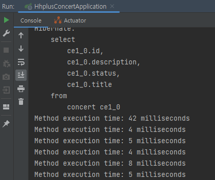
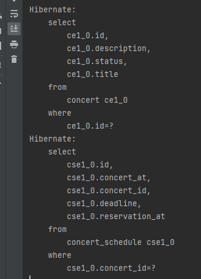
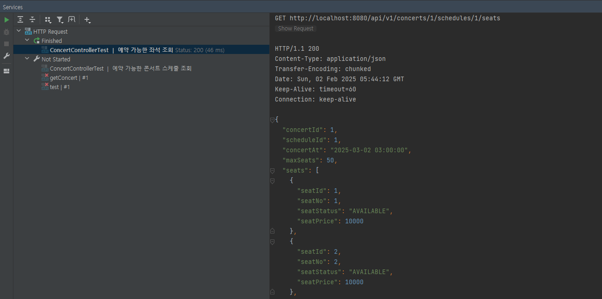
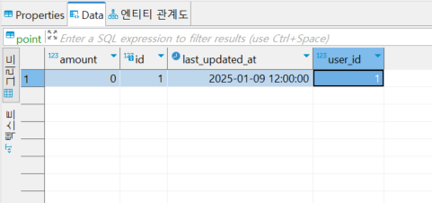
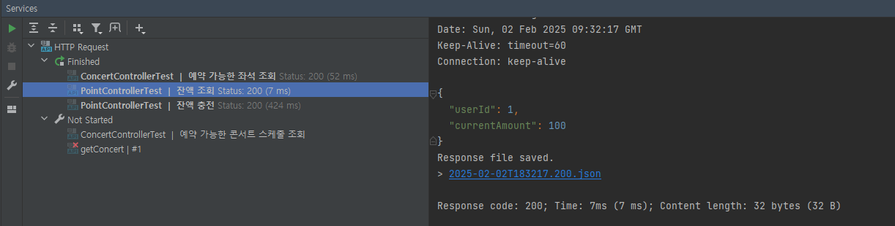
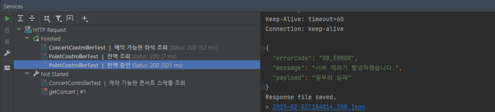

# 💾캐시 기법 활용

## 목차
1. 캐시(Cache)란?
2. 캐시 전략 패턴 종류
   1. 캐시 읽기 전략
      1. Look Aside 패턴
      2. Read Through 패턴
      3. 전략 차이점 및 요약
   2. 캐시 쓰기 전략
      1. Write Back 패턴
      2. Write Through 패턴
      3. Write Around 패턴
      4. 전략 차이점 및 요약
   3. 어떤 데이터를 캐싱해야할까?

3. 콘서트 예약서비스 Redis 적용
   1. 콘서트 조회 API
   2. 예약 가능한 콘서트 일정 조회 API
   3. 예약 가능한 좌석 조회 API
   4. 포인트 조회 API
   5. 포인트 충전 API

---
## 1. 캐시(Cache)란?
- Cache란 한번 조회된 데이터를 미리 특정 공간에 저장해놓고, 똑같은 요청이 발생하게 되면 서버에게 다시 요청하지 말고 저장해놓은 데이터를 제공해서 빠르게 서비스를 제공해주는 것을 의미합니다.  
- 즉, 미리 결과를 저장하고 나중에 요청이 오면 그 요청에 대해서 DB 또는 API를 참조하지 않고 Cache를 접근하여 요청을 처리하는 기법입니다.

`캐시를 사용하는 가장 큰 이유?`  
캐시를 사용하는 여러 가지가 있지만 가장 큰 이유는 클라이언트에게 더욱 빠르게 데이터를 주기위함입니다.  
예시를 통해서 사용하지 않을때와 사용할때를 비교해보겠습니다.  

`캐시를 사용하지 않을때`  


`캐시 사용할 때`  


예시는 조금 과장되었지만, 가정을 하자면 캐시는 1초만에 응답 해줍니다. 하지만 데이터베이스는 응답하는데 10초가 걸립니다.  
따라서, 캐시를 사용하는 것이 시간적으로 큰 이점을 얻을 수 있습니다.  
이렇게 빠르게 데이터가 전달이 가능한 이유는 Database는 SSD 혹은 HDD에서 데이터를 가져오지만, Redis(캐시 저장소)는 메모리에서 데이터를 가져오기 때문입니다.  

---

## 2. 캐시 전략 패턴 종류
### 1. 캐시 읽기 전략
#### 1. Look Aside 
- Lazy 로딩 읽기 전략으로 **가장 많이 사용되는 전략**입니다.
- 레디스를 먼저 확인하고, 있으면 조회하고 없으면 데이터베이스를 조회한 이후에 레디스에 저장합니다.


1. 캐시에 데이터가 있는지 확인한다.
2. 데이터가 캐싱되어 있으면, 즉시 클라이언트에게 해당 데이터를 제공한다. (cache hit)
3. 데이터가 캐싱되어 있지 않다면, 서버는 데이터베이스에서 데이터를 가져오기 위해 쿼리를 보내고 클라이언트에게 응답한다.
4. 이후 데이터를 캐시에 저장한다. (cache miss)
5. 동일한 요청에 대해서는 캐시에서 즉시 데이터를 제공할 수 있다.


#### 특징
- 캐시를 먼저 조회하기 때문에 캐시와 데이터베이스의 데이터 일관성이 깨질 수 있다. 이를 해결하기 위해서 일반적으로 *TTL(Time To Live)를 활용하여 특정 시간이 지나면 다시 DB에서 값을 조회하도록 하여 일관성을 맞춥니다.
- 초기 조회 시 무조건 Data Store를 호출 해야 하므로 **단건 호출 빈도가 높은 서비스**에 적합하지 않다. 대신 **반복적으로 동일 쿼리를 수행하는 서비스**에 적합한 아키텍처입니다.
- 캐시에 장애가 발생하더라도 데이터베이스에서 데이터를 가져올 수 있어 서비스 운영은 가능하지만, 갑작스럽게 데이터베이스에 부하가 생길 수 있습니다. (*Cache Stampede)

> `Cache Stampede`
>
> N명이 동시에 같은 콘서트 정보 조회 -> (캐시미스) -> DB 로 다 연결해서 데이터 가져오려함.   
> DB 로 다 연결하려는 것도 문젠데... 각자가 Look-Aside 형태로 캐시를 또 쓴다...(Overwrite)  
> 문제 2가지: `DB hit`, `Cache OverWrite`  
> 이를 방지하기 위해 *Cache Warming, 적절한 TTL 설정 그리고 캐시 조회 시 TTL을 확인하여, 얼마 남지 않은 경우 재할당하거나 하는 방어 로직을 추가할 수 있습니다.  
>

> `Cache Warming`
> 
> 캐시를 사전에 예열하는 과정입니다.
> 시스템이 재시작 또는 배포 후 처음 시작될 때, 자주 접근되는 데이터는 아직 캐시에 로드되지 않아 초기 요청에서는 높은 대기 시간이 발생할 수 있습니다.  
> 이러한 초기 대기 시간을 줄이기 위해, 시스템이 작동하기 전에 주요 데이터를 캐시에 미리 로드하는 것입니다.

---

#### 2. Read Through
- 서버에서 **캐시에서만** 데이터를 읽어오는 전략입니다.


1. 캐시에 데이터가 있는지 확인한다.
2. 데이터가 캐싱되어 있으면, 즉시 클라이언트에게 해당 데이터를 제공한다. (cache hit)
3. 데이터가 캐싱되어 있지 않다면, 캐시가 데이터베이스에서 데이터를 읽어와 캐시에 저장한다. (cache miss)
4. 이후 클라이언트에게 응답한다.

#### 특징
- Look-Aside와 비슷하지만, 서버가 캐시를 채우는 역할을 하느냐 마느냐에 따라 차이가 존재합니다.
- Read-Though에서는 데이터 동기화 라이브러리나 캐싱 서비스 제공자에 의해 데이터베이스의 데이터를 저장합니다.
- 데이터 동기화가 항상 이루어져 데이터 일관성은 맞지만, 전체적으로 조회 속도가 느립니다.
- 데이터 조회 시 캐시에만 의존하기 때문에 캐시에 장애가 발생할 경우 서비스 이용에 문제가 생길 수 있습니다.
- 따라서 Replication 또는 Cluster 구성을 통해 가용성을 높여야 합니다.
- 무조건 캐시에 저장하기 때문에 리소스 낭비가 발생할 수 있습니다. 따라서, TTL을 사용하여 사용되지 않는 데이터는 삭제해야 합니다.

---

#### 3. `Look Aside`와 `Read-Through` 차이점 및 요약
> `Look Asdie`는 cache를 확인해보고 없다면, 데이터 베이스를 조회하여 데이터를 저장 및 클라이언트에게 데이터 제공 하는 특징이 있습니다.  
> 그러나 `Read-Through` 무조건 cache만 보기 때문에 데이터베이스를 조회하지 않는 특징이 있습니다. 

---
### 2. 캐시 쓰기 전략
#### 1. Write Back
- 캐시에 먼저 저장하고, 일정 주기 배치 작업을 통해 데이터베이스에 저장하는 전략입니다.


1. 모든 데이터를 캐시에 저장한다.
2. 일정 시간이 지난 뒤에 데이터베이스에 저장한다.

#### 특징
- 캐시에 데이터를 모았다가 일정 주기로 데이터베이스에 저장하기 때문에 데이터베이스 쓰기 부하를 줄일 수 있습니다.
- 하지만, 데이터를 저장하기 전에 캐시에 장애가 발생하면 데이터 유실이 발생할 수 있습니다.
- 쓰기 연산은 빈번하면서 읽기 연산을 하는데 많은 양의 리소스가 소모되는 서비스에 적합합니다.
- 무조건 캐시에 저장하기 때문에 리소스 낭비가 발생할 수 있습니다. TTL을 사용하여 사용되지 않는 데이터는 삭제해야 합니다.

---

#### 2. Write Through
- 데이터베이스와 캐시에 동시에 데이터를 저장하는 전략입니다.


1. 저장할 데이터를 캐시에 먼저 저장한다.
2. 즉시 캐시에서 데이터베이스로 저장한다.

#### 특징
- Read Through와 동일하게 데이터베이스와 데이터 동기화 작업을 캐시에게 위임합니다.
- 데이터베이스와 캐시가 항상 동기화되어 있어, 캐시의 데이터는 항상 최신 상태로 유지됩니다.
- 매 요청마다 두 번의 쓰기 연산이 발생하게 되어, 쓰기 작업이 많은 서비스에는 부적합할 수 있습니다.
- 무조건 캐시에 저장학 때문에 리소스 낭비가 발생할 수 있다. TTL을 사용하여 사용되지 않는 데이터는 삭제해야 합니다.

---

#### 3. Write Around
- 모든 데이터를 데이터베이스에 저장하는 전략입니다.


1. 모든 데이터를 데이터베이스에 저장한다. 캐시를 갱신하지 않는다.

#### 특징
- 속도는 빠르지만, cache miss가 발생하기 전에 데이터베이스에 저장된 데이터가 수정되었을 경우 캐시와 데이터베이스 간의 데이터 불일치가 발생합니다.

---
#### 3. `Write Back`, `Write Through`, `Write Around` 차이점 및 요약
> `Write Back`과 `Write Through`는 캐시에 저장한다는 공통된 특징이 있습니다.  
> 그러나 데이터를 모았다가 배치작업에 맞춰 데이터베이스에 저장하면 `Write Back`전략이며, 데이터를 즉시 데이터베이스에 저장하면 `Write Through`라는 차이가 있습니다.  
> 데이터를 캐시에 저장하지 않고, 데이터베이스에만 저장한다면, `Write Around`전략입니다.  

---

### 3. 어떤 데이터를 캐싱해야할까?
이전에 캐싱의 정의, 전략 등을 살펴봤는데 그렇다면 데이터를 캐싱하는 것이 무조건 좋을까요?  
앞서 살펴본 캐싱 원리를 다시 분석해보겠습니다.


여기서는 해당 원리에서 캐싱이 좋지 않은 상황들을 생각해보겠습니다.

- 대부분의 데이터가 처음 요청되는 데이터여서 동일한 데이터 요청이 자주 발생하지 않는 경우
  - 위의 원리를 살펴보면 결국 동일한 데이터 요청이 왔을 때 캐싱의 효과가 발생합니다.
  - 만약, 요청 시마다 새로운 데이터를 요청하게 된다면 캐싱하는 의미가 사라집니다.
  - 이렇게 되면 리소스를 들여서 캐시 저장소를 사용할 이유가 없게 됩니다.


- 데이터가 자주 변경되는 경우
  - 데이터가 자주 변경된다면, 캐시 저장소의 데이터와 DB 데이터 사이에 데이터 정합성 문제가 발생할 수 있습니다.
  - 이를 방지하기 위해 데이터가 변경되는 경우 캐시의 데이터를 지우는 '캐시 무효화'를 수행합니다.
  - 데이터가 자주 변경된다면 캐시 무효화 비용이 캐싱으로 얻는 절감 비용보다 커질 수 있습니다.


> 그래서 프로젝트에서 캐싱할 데이터를 생각했을 때, 다음과 같은 2가지 기준으로 고려하는 것이 좋을 것 같다고 판단했습니다.
> - 동일한 데이터의 요청이 자주 발생하는가?(조회 빈도)  
> - 해당 데이터의 변경보다 조회가 빈번한가?(변경 빈도)

---

## 3. 콘서트 예약서비스 Redis 적용
`요구사항`
> 조회가 오래 걸리는 쿼리에 대한 캐싱, 혹은 Redis 를 이용한 로직 이관을 통해 성능 개선할 수 있는 로직을 분석

### 1. 콘서트 조회 API (`GET /api/v1/concerts`)
`설명`
- 콘서트 목록을 조회한다.

`분석`
- **조회 빈도**: 콘서트 예약 시스템에서 콘서트 조회는 사용자가 가장 많이 사용하게 되는 기능입니다.**(높음)**
- **변경 빈도**: 콘서트 데이터가 추가되거나 수정되는 빈도는 낮습니다.**(낮음)**

#### 적용 및 테스트 과정
- 먼저, 캐시를 적용하기 위한 코드를 추가합니다.
- 임의의 데이터를 미리 데이터베이스에 추가해줍니다.
- API 호출을 했을 때, 첫 호출에는 데이터베이스에서 꺼내오며, 이후에는 Redis에 저장된 데이터를 사용합니다.


`ConcertFacade.java`
```java
// 콘서트 목록 조회
public class ConcertFacade {

    private final ConcertService concertService;

    // 콘서트 목록 조회
    @Cacheable(value = "concert", key = "'all'", cacheManager = "redisCacheManager")
    public List<Concert> getConcerts() {
        return concertService.getConcerts();
    }
}
```

`CacheConfig.java`
```java
@EnableCaching
@Configuration
@RequiredArgsConstructor
public class CacheConfig {

    private final RedisConnectionFactory redisConnectionFactory;

    @Bean
    @Primary
    public RedisCacheManager redisCacheManager() {
        return RedisCacheManager.builder(redisConnectionFactory)
                .cacheDefaults(redisCacheConfiguration(Duration.ofMinutes(10)))
                .transactionAware()
                .build();
    }

    private RedisCacheConfiguration redisCacheConfiguration(Duration ttl) {
        return RedisCacheConfiguration.defaultCacheConfig()
                .entryTtl(ttl)
                .disableCachingNullValues()
                .serializeKeysWith(RedisSerializationContext.SerializationPair.fromSerializer(new StringRedisSerializer()))
                .serializeValuesWith(RedisSerializationContext.SerializationPair.fromSerializer(new GenericJackson2JsonRedisSerializer(customObjectMapper())
                ));
    }

    private ObjectMapper customObjectMapper() {
        return new ObjectMapper()
                .findAndRegisterModules()
                .enable(SerializationFeature.INDENT_OUTPUT) // JSON을 보기 좋게 들여쓰기(Pretty Print) 적용
                .disable(SerializationFeature.WRITE_DATES_AS_TIMESTAMPS)
                .configure(DeserializationFeature.FAIL_ON_UNKNOWN_PROPERTIES, false) // JSON 데이터를 객체로 변환할 때, 정의되지 않은 필드가 있어도 오류가 나지 않도록 설정
                .setDefaultPropertyInclusion(JsonInclude.Include.NON_NULL)
                .activateDefaultTyping(
                        BasicPolymorphicTypeValidator.builder()
                                .allowIfBaseType(Object.class)
                                .build(),
                        ObjectMapper.DefaultTyping.EVERYTHING,
                        JsonTypeInfo.As.PROPERTY)
                .registerModule(new JavaTimeModule());
    }
}
```
- 10분동안 TTL(Time to live)을 정의해줬습니다.(너무 오래되면 문제가 데이터 정합성에 문제가 생기기 때문)
- transactionAware() 추가하여, 트랜잭션이 롤백되었을 시 Redis에 저장되지 않도록 설정했습니다.
- JSON ↔ Java 객체 변환을 담당하는 customObjectMapper 추가해줬습니다.

> 이후의 코드에서는 위 CacheConfig 설정을 동일하게 사용합니다.


#### 캐시가 잘 적용 되었는지 테스트(With HttpClient)

`데이터베이스`


- 위와같이 데이터를 미리 추가해둬서 테스트를 진행했습니다.

---

`HttpClient 호출 시`


- 실제로 API(/api/v1/concerts)를 호출했을 때 위와 같이 응답을 받을 수 있습니다.

---

`서버 로그`


- 이때, 서버는 Redis에 데이터가 없기 때문에 Database에서 조회(Hibernate: ... ce1_0까지)하고, 클라이언트에게 반환하며, Redis에 저장됩니다.

---

`API 호출 전 Redis`


- API를 호출하기 전에 데이터가 비어져 있음을 확인합니다.

---

`API 호출 후 Redis`


- 이제 Redis를 확인하면 위와 같이 데이터가 생성되었음을 확인할 수 있습니다.
- 해당 데이터의 TTL(Time to Live)를 10분으로 설정했기 때문에 10분동안 유효합니다.

---

`서버 로그`


- `---` 이 부분 밑에 아무로그도 남지 않았습니다.
- 이는 결국, 동일한 API(/api/v1/concerts)를 호출했을 때 이제 Database에서 조회하지 않고, Redis에서 조회함을 뜻합니다.

---

`동작 시간`

`ConcertController.java`
```java
public class ConcertController {

    private final ConcertFacade concertFacade;

    // 콘서트 목록 조회
    @GetMapping
    public ResponseEntity<GetConcertDto.ConcertResponse> getConcerts() {
        long startTime = System.currentTimeMillis(); // 코드 시작 시간
        List<Concert> concerts = concertFacade.getConcerts();
        long endTime = System.currentTimeMillis(); // 코드 끝난 시간
        long duration = endTime - startTime;
        System.out.println("Method execution time: " + duration + " milliseconds");
        return ok(GetConcertDto.ConcertResponse.of(concerts));
    }
}

```

`레디스에서 데이터 가져온 실행결과`




- 첫번째로찍힌 166ms, 42ms는 데이터베이스에서 조회했을 때 걸린 시간이며, 그 아래는 전부 캐시를 통해 가져온 시간입니다.
- 레디스에서 실제로 데이터를 가져왔을 때 위와 같이 약 16ms 이하로 처리됨을 확인할 수 있었습니다.
- 실제로 캐시를 사용했을 때 확실히 데이터를 가져오는 속도가 줄어듬을 확인할 수 있습니다.


---

`ConcertFacade.java`
```java
// 콘서트 목록 조회
public class ConcertFacade {

    private final ConcertService concertService;

    // 콘서트 목록 조회
    // @Cacheable(value = "concert", key = "'all'", cacheManager = "redisCacheManager")
    public List<Concert> getConcerts() {
        return concertService.getConcerts();
    }
}
```

- 그러나 이것이 정말 캐시(Redis)때문인지 확인을 하고 싶었기때문에 위와 같이 주석처리 후 한번 더 테스트를 진행해보겠습니다.

---

`@Cacheable 주석처리 후 데이터 가져온 실행결과`


- 첫 호출에만 100ms 이상 시간이 걸리며, 나머지 호출에서는 약 30ms정도의 시간이 걸림을 알 수 있었습니다.
- 이를 통해 redis를 통해서 데이터를 가져오는 것이 최소 2배 이상 더 빠르게 전달 됨을 확인할 수 있었습니다.

---

#### 결론

> 호출 빈도↑, 변경 빈도↓ 로 판단하여 진행했으며, 실제 테스트에서도 유의미한 결과가 보였기에 Redis로 캐싱하는 것을 선택했습니다.  
> 
> `그렇다면 어떤 전략을 사용한걸까?`  
> 
> 읽기 전략 중 Look Aside 전략을 사용한 것과 같습니다.  
> Cache Miss가 발생할 시 DataBase에서 조회하고, 이 데이터를 캐시에 저장하고 클라이언트에게 반환하기 때문입니다.  
>
> `@Cacheable`은 무조건 Look Aside야?  
> 네 맞습니다.

---


### 2. 예약 가능한 콘서트 일정 조회 API (`GET /api/v1/concerts/{concertId}/schedules`)
`설명`
- 특정 콘서트의 예약 가능한 날짜를 조회한다.

`분석`
- **조회 빈도**: 콘서트 예약 시 자주 조회합니다.**(높음)**
- **변경 빈도**: 콘서트 일정은 자주 변경되지 않으므로 데이터 변경 빈도는 낮습니다.**(낮음)**

#### 적용 및 테스트 과정
- 먼저, 캐시를 적용하기 위한 코드를 추가합니다.
- 임의의 데이터를 미리 데이터베이스에 추가해줍니다.
- API 호출을 했을 때, 첫 호출에는 데이터베이스에서 꺼내오며, 이후에는 Redis에 저장된 데이터를 사용합니다.

---
`코드 추가`

`ConcertFacade.java`
```java
public class ConcertFacade {

    private final ConcertService concertService;

    // 예약 가능한 콘서트 일정 조회
    @Cacheable(value = "concert", key = "#concertId", cacheManager = "redisCacheManager")
    public List<ConcertSchedule> getAvailableConcertSchedules(Long concertId) {
        Concert concert = concertService.getConcert(concertId);
        return concertService.getAvailableConcertSchedules(concert);
    }
}
```
- 위와 같이 Key는 concertId로 넣어줬습니다.
- cacheManager은 redisCacheManager로 콘서트 목록 조회와 동일합니다.

---

`데이터베이스`


- 위와같이 데이터를 미리 추가해둬서 테스트를 진행했습니다.

---

`HttpClient 호출 시`


- 실제로 API(/api/v1/concerts/1/schedules)를 호출했을 때 위와 같이 응답을 받을 수 있습니다.

---

`서버로그`



- 이때, 서버는 Redis에 데이터가 없기 때문에 Database에서 조회(Hibernate: ... cse1_0.concert_id=?까지)하고, 클라이언트에게 반환하며, Redis에 저장됩니다.

---

`API 호출 후 Redis`


- 이제 Redis를 확인하면 위와 같이 데이터가 생성되었음을 확인할 수 있습니다.
- 해당 데이터의 TTL(Time to Live)를 10분으로 설정했기 때문에 10분동안 유효합니다.

---

`서버 로그`


- `---` 이 부분 밑에 아무로그도 남지 않았습니다.
- 이는 결국, 동일한 API(/api/v1/concerts/1/schedules)를 호출했을 때 이제 Database에서 조회하지 않고, Redis에서 조회함을 뜻합니다.

---

`동작 시간`

`ConcertController.java`
```java
public class ConcertController {

    private final ConcertFacade concertFacade;

    /**
     * 예약 가능한 콘서트 스케줄 조회
     */
    @GetMapping("/{concertId}/schedules")
    public ResponseEntity<GetScheduleDto.ScheduleResponse> getAvailableConcertSchedules (
            @PathVariable Long concertId
    ) {
        List<ConcertSchedule> schedules = concertFacade.getAvailableConcertSchedules(concertId);
        return ok(GetScheduleDto.ScheduleResponse.of(concertId, schedules));
    }
}
```

`레디스에서 데이터 가져온 실행결과`


- 첫번째로찍힌 230ms는 데이터베이스에서 조회했을 때 걸린 시간이며, 그 아래는 전부 캐시를 통해 가져온 시간입니다.
- 레디스에서 실제로 데이터를 가져왔을 때 위와 같이 대부분 3ms 로 처리됨을 확인할 수 있었습니다.
- 실제로 캐시를 사용했을 때 확실히 데이터를 가져오는 속도가 줄어듬을 확인할 수 있습니다.

---

#### 결론

> 호출 빈도↑, 변경 빈도↓ 로 판단하여 진행했으며, 실제 테스트에서도 유의미한 결과가 보였기에 Redis로 캐싱하는 것을 선택했습니다.  
> 
> `그렇다면 어떤 전략을 사용한걸까?`  
> 위와 같이 읽기 전략 중 Look Aside 전략을 사용한 것과 같습니다.  
> Cache Miss가 발생할 시 DataBase에서 조회하고, 이 데이터를 캐시에 저장하고 클라이언트에게 반환하기 때문입니다.  

---

### 3. 예약 가능한 좌석 조회 API (`GET /api/v1/concerts/{concertId}/schedules/{scheduleId}/seats`)
`설명`
- 특정 콘서트 일정에 대해 예약 가능한 좌석을 조회한다.

`분석`
- **조회 빈도**: 콘서트 예약 시 자주 조회합니다.**(높음)**
- **변경 빈도**: 예약상황에 따라 변경이 자주 발생할 수 있습니다.**(높음)**


#### 적용 및 테스트 과정
- 자주 조회되지만, 변경 빈도는 높기에 짧은 TTL로 캐시하는 형태로 구현해보겠습니다.
- 위의 구현과 마찬가지로 캐시적용을 위한 코드를 추가합니다.
- 임의의 데이터를 미리 데이터베이스에 추가해줍니다.
- API 호출을 했을 때, 첫 호출에는 데이터베이스에서 꺼내오며, 이후에는 Redis에 저장된 데이터를 사용합니다.

---
`코드 추가`

`ConcertFacade.java`
```java
public class ConcertFacade {

    private final ConcertService concertService;

    // 예약 가능한 좌석 조회
    @Cacheable(value = "fiveSecondCache", key = "#concertScheduleId", cacheManager = "redisCacheManager")
    public SeatsResult getAvailableSeats(Long concertScheduleId) {
        ConcertSchedule concertSchedule = concertService.getSchedule(concertScheduleId);
        List<Seat> seats = concertService.getAvailableSeats(concertScheduleId);

        return SeatsResult.from(concertSchedule, seats);
    }
}
```

`CacheConfig.java`
```java
public class CacheConfig {

    private final RedisConnectionFactory redisConnectionFactory;

    @Bean
    @Primary
    public RedisCacheManager redisCacheManager() {
        return RedisCacheManager.builder(redisConnectionFactory)
                .cacheDefaults(redisCacheConfiguration(Duration.ofMinutes(DEFAULT_CACHE_TIME)))
                .withInitialCacheConfigurations(Map.of(
                        "fiveSecondCache", redisCacheConfiguration(Duration.ofSeconds(5)) // 다음과 같이 추가 했습니다.
                ))
                .transactionAware()
                .build();
    }
}
```

- 5초만 유효하도록 위와 같이 추가했습니다.

---

#### 캐시가 잘 적용 되었는지 테스트(With HttpClient)

`데이터베이스`


- 위와같이 데이터를 미리 추가해둬서 테스트를 진행했습니다.

---

`HttpClient 호출 시`




- 실제로 5초간 데이터가 실제로 유효했으며, 이후에 사라지는 것을 확인할 수 있었습니다.

---

`서버 로그`


- 자세히 확인해보면, 첫 호출에는 데이터베이스 쿼리가 작성되어 실행되었습니다.(263 milliseconds 윗 부분)
- 그리고 이후에는 데이터베이스 호출 없이, 컨트롤러가 실행 됨을 확인할 수 있습니다.(59 milliseconds ~ 4 milliseconds)
- 5초 후에는 다시 데이터베이스 쿼리를 작성해서 쿼리가 작성됨을 확인할 수 있었습니다.(4 milliseconds 아랫 부분)

---

#### 결론

> 호출 빈도↑, 변경 빈도↑ 로 판단하여 진행했으며, 실제 테스트에서도 유의미한 결과가 보였기에 Redis로 캐싱하는 것을 선택했습니다.
>
> `데이터가 자주 변경되는데 왜 캐싱을 진행했을까?`  
> 속도적으로 차이도 있지만, 데이터베이스의 부하를 줄이기 위함도 있었습니다.(HIkariCP는 기본적으로 10개 제공)  
> 순간적으로 데이터가 몰리는 데이터이기에 짧은 TTL을 가져가면서, 데이터변경에도 대응가능하며, 빠르게 데이터를 전달할 수 있다고 판단했습니다.  
> 자주 변경이 되더라도 조회요청이 많다면, 짧은 TTL을 통해 캐싱의 장점을 충분히 가져갈 수 있습니다.  
> 
> `그렇다면 어떤 전략을 사용한걸까?`  
> 
> 위와 같이 읽기 전략 중 Look Aside 전략을 사용한 것과 같습니다.  
> Cache Miss가 발생할 시 DataBase에서 조회하고, 이 데이터를 캐시에 저장하고 클라이언트에게 반환하기 때문입니다.

---

### 4. 포인트 조회 API (`GET /api/v1/users/{userId}/point`)
#### 설명
- 특정 사용자가 포인트 잔액을 조회한다.

#### 분석
- **조회 빈도**: 마이페이지와 같은 곳에서 잔액을 자주 조회할 수 있습니다.**(높음)**
- **변경 빈도**: 결제나 충전으로 변경이 발생할 수 있어 데이터 변경 빈도는 중간 정도로 생각했습니다.**(중간)**
- 매번 마이페이지에 들어갈 때마다 데이터베이스에서 유저의 포인트 잔액이 조회되는 것은 불필요하다고 판단했습니다.
- 따라서, 글로벌 캐시(레디스)를 통해 캐싱하돼, 충전시에 Write Through 방식으로 캐싱하면 정합성의 문제를 해결할 수 있을 것입니다.

#### 적용 및 테스트 과정
- 먼저, 캐시를 적용하기 위한 코드를 추가합니다.
- 임의의 데이터를 미리 데이터베이스에 추가해줍니다.
- API 호출을 했을 때, 첫 호출에는 데이터베이스에서 꺼내오며, 이후에는 Redis에 저장된 데이터를 사용합니다.

---
`코드 추가`

`PointFacade.java`
```java
public class PointFacade {
    private final UserService userService;
    private final PointService pointService;

    @Cacheable(value = "point", key = "#userId", cacheManager = "redisCacheManager")
    public Point getPoint(Long userId) {
        userService.validateUser(userId);
        return pointService.getPoint(userId);
    }
}
```

- 위와 같이 Key는 userId로 넣어줬습니다.
- cacheManager은 redisCacheManager로 콘서트 목록 조회와 동일합니다.

> 여기서 주의해야할 점은 정합성을 위해 충전시에도 key를 맞춰야한다는 것 입니다.

---

`데이터베이스`



- 위와 같이 데이터를 미리 추가해둬서 테스트를 진행했습니다.

---

`HttpClient 호출 시`


- 실제로 데이터가 약 10분 동안 유효했으며, 이후에 사라지는 것을 확인할 수 있었습니다.

---

`서버 로그`


- 첫 호출에 약 265ms정도가 소요되었으며 이후 호출에는 4ms 이내로 수행됨을 확인할 수 있었습니다.

---

#### 결론

> 호출 빈도↑, 변경 빈도 중간 으로 판단하여 진행했으며, 실제 테스트에서도 유의미한 결과가 보였기에 Redis로 캐싱하는 것을 선택했습니다.
> 
> `포인트는 특성상 데이터의 정합성이 중요한데, 그럼에도 캐싱을 한 이유는?`  
> 
> 포인트가 변경되는 로직은 충전과 사용되는 로직인데, 이 2가지 로직에서 Write through 방식을 채택한다면 호출 빈도가 높은 로직을 정합성을 준수하며 처리할 수 있을 것이라고 판단했습니다.
> 
> `그렇다면 어떤 전략을 사용한걸까?`
>
> 위와 같이 읽기 전략 중 Look Aside 전략을 사용한 것과 같습니다.  
> Cache Miss가 발생할 시 DataBase에서 조회하고, 이 데이터를 캐시에 저장하고 클라이언트에게 반환하기 때문입니다.

---

### 5. 포인트 충전 API (`PATCH /api/v1/users/{userId}/point`)
#### 설명
- 특정 사용자가 포인트 잔액을 충전한다.

#### 분석
- **조회 빈도**: 실질적으로 포인트 충전에서 조회는 일어나지 않으나, 조회 로직의 정합성을 맞추기 위함입니다.
- **변경 빈도**: 콘서트 좌석예매를 위해  포인트 충전으로 변경이 발생할 수 있어 데이터 변경 빈도는 중간 정도로 생각했습니다.**(중간)**
- 이전까지는 데이터 읽기를 적용했지만 이번에는 데이터 쓰기를 진행해보도록 하겠습니다.

#### 적용 및 테스트 과정
- 먼저, 캐시를 적용하기 위한 코드를 추가합니다.
- 임의의 데이터를 미리 데이터베이스에 추가해줍니다.
- API 호출(충전)을 했을 때, 캐시에도 저장되는 것을 목표로 합니다.


---
`코드 추가`

`PointFacade.java`
```java
public class PointFacade {
    private final UserService userService;
    private final PointService pointService;
    
    @CachePut(value = "point", key = "#userId", cacheManager = "redisCacheManager")
    public Point chargePoint(Long userId, Long amount) {
        userService.validateUser(userId);
        return pointService.chargePoint(userId, amount);
    }
}
```

- **여기서 주의해야할 점은 포인트 조회와 꼭 같은 Value와 Key를 사용해야한다는 점 입니다.**
- 만약 Value, Key가 다르다면 저장되는 곳이 다르기 때문에 조회할 때 충전 후 업데이트 된 포인트를 확인할 수 없습니다.

---

`데이터베이스`


- 데이터 조회때 넣어뒀던 데이터를 동일하게 사용했습니다.

---

`HttpClient 호출 시`

```http request
### 잔액 충전
PATCH localhost:8080/api/v1/users/1/point
Content-Type: application/json

{
  "amount": 100
}
```



- 위처럼 충전이 잘 된것을 확인할 수 있습니다.


- 이때 중요한 것은 충전이 얼마나 걸리는지가 아닙니다.
- 충전 로직이 잘 수행되었을 때 조회할때 데이터베이스를 조회하는 것이 아니라 Redis(글로벌 캐시)를 조회하는지 보는 것 입니다.
- 337ms 소요된 것은 충전 로직이며, 아래는 조회를 호출했을 때 입니다.
- DB쿼리가 실행되지않고, 매우 짧은 시간에 수행되는 것을 보니 캐시가 잘 적용된 것 같습니다.


- 실제로 Redis를 들어가서 확인해보니 충전 된 것이 잘 저장되었음을 확인했습니다.

> "만약에 충전 로직이 중간에 롤백 되었는데 데이터가 캐시로 저장되면 어쩌지?" 라는 의문으로 아래의 실험을 진행했습니다.

---
`코드 변경`

`PointService.java`
```java
@Transactional
public Point chargePoint(Long userId, Long amount) {
    Point point = pointRepository.findPoint(userId);
    Point updatedPoint = point.charge(amount);
    pointRepository.save(updatedPoint);
    throw new RuntimeException("일부러 실패");
    // return updatedPoint;
}
```

- 현재 위와같이 되어있는 로직에 일부러 런타임 오류를 발생시켰습니다.
- 의도한대로 동작하기 위해서는, 캐시에 저장되지 않아야합니다.

---

`수행결과`



- 위와 같이 응답을 받았습니다.


- 데이터베이스와 Redis 모두 확인했을 때 저장 되지 않음을 확인할 수 있었습니다.


> 여기서 한 발 더 나아가서 @CachePut과 @Transactional이 동시에 있을 때 보장이 될지 궁금했습니다.  
> 따라서 아래와 같이 코드를 수정하고 테스트를 진행해봤습니다.  

---
`코드 변경`

`PointFacade.java`
```java
@Transactional
@CachePut(value = "point", key = "#userId", cacheManager = "redisCacheManager")
public Point chargePoint(Long userId, Long amount) {
    userService.validateUser(userId);
    Point point = pointService.chargePoint(userId, amount);
    throw new RuntimeException("일부러 실패");
//        return pointService.chargePoint(userId, amount);
}
```

`수행 결과`


- `@Transactional`과 `@CachePut`이 같이 있더라도 데이터베이스가 롤백되면 Redis에도 저장 되지 않음을 확인할 수 있었습니다.

---

#### 결론

> 포인트조회에서 이미 캐싱을 사용하고 있기에 충전에서 사용해야 했습니다.  
> 만약 포인트 조회에서는 캐싱을 사용하지만, 충전에서 사용하지 않으면 정합성에 문제가 생기기 때문입니다.  
>
> `그렇다면 어떤 전략을 사용한걸까?`
>
> 쓰기 전략 중 데이터베이스와 Redis(캐시) 모두 저장한 Write Through 전략을 사용한 것과 같습니다.
