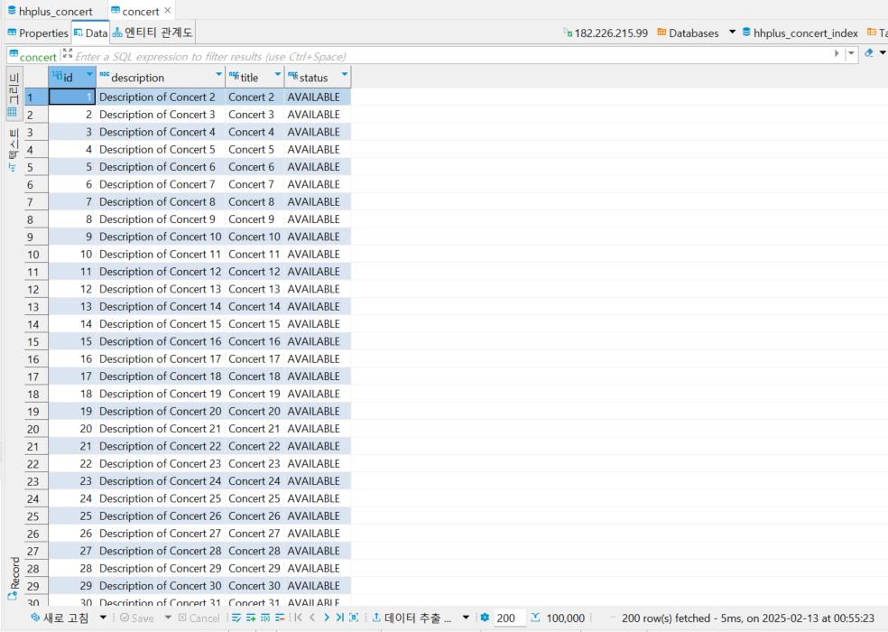
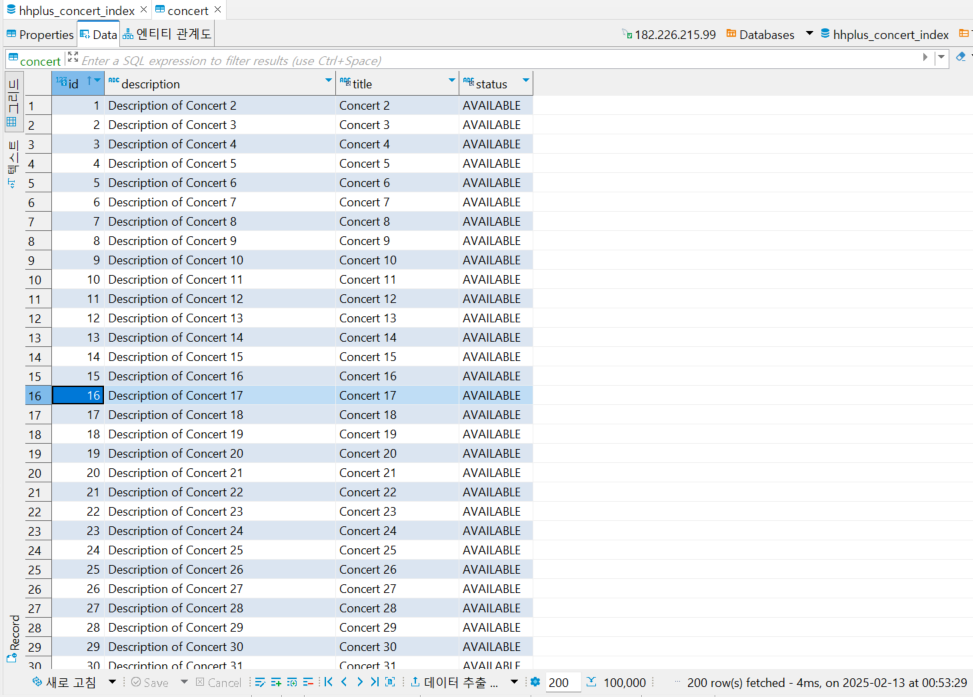

# 📦 데이터베이스 인덱스 개선

## 인덱스란?
[index가 뭔지 설명해보세요](https://youtu.be/iNvYsGKelYs?si=a2FbzFnAdFAIWEPP) 을 통해 쉽고, 자세하게 배울 수 있습니다.  
추가적인 쓰기 작업과 저장 공간을 활용하여 데이터베이스 테이블의 검색 속도를 향상시키기 위한 자료구조입니다.  
만약 우리가 책에서 원하는 내용을 찾는다고 하면, 책의 모든 페이지를 찾아 보는것은 오랜 시간이 걸립니다.  
그렇기 때문에 책의 저자들은 책의 맨 앞 또는 맨 뒤에 색인을 추가하는데, 데이터베이스의 index는 책의 색인과 같습니다.  
데이터베이스에서도 테이블의 모든 데이터를 검색하면 시간이 오래 걸리기 때문에 데이터와 데이터의 위치를 포함한 자료구조를 생성하여 빠르게 조회할 수 있도록 돕고 있습니다.  


## 쿼리 조회가 필요한 API
1. 콘서트 조회: `GET` `/api/v1/concerts`
2. 예약 가능 일정 조회: `GET` `/api/v1/concerts/{concertId}/schedules`
3. 예약 가능 좌석 조회: `GET` `/api/v1/concerts/{concertId}/schedules/{scheduleId}/seats`
4. 포인트 조회: `GET` `/api/v1/users/{userId}/point`
5. 포인트 충전: `PATCH` `/api/v1/users/{userId}/point`
6. 콘서트 좌석 예약: `POST` `/api/v1/reservations`
7. 결제: `POST` `/api/v1/payments`

---

## 쿼리 분석
### 1. 콘서트 조회
- 설명: 사용자가 콘서트 목록 조회하기 위해 사용됩니다.
- 호출 빈도: 높음
  - 콘서트 목록을 확인할 때마다 조회되므로 자주 사용됩니다.
- 쿼리 복잡도: 낮음
  - 하나의 테이블의 모든 컬럼을 조회합니다.
- 쿼리

```sql
# 콘서트 조회를 위해 필요한 쿼리
select 
  ce1_0.id,
  ce1_0.description,
  ce1_0.status,
  ce1_0.title 
from 
  concert ce1_0
```

---

### 2. 콘서트 예약 가능 일정 조회
- 설명: 사용자가 특정 콘서트의 예약 가능한 일정을 조회하기 위해 사용됩니다. 
- 호출 빈도: 높음
  - 예약 가능 일정을 조회할 때마다 호출되므로 자주 사용됩니다.
- 쿼리 복잡도: 낮음
  - 2개의 테이블을 간단한 WHERE절을 통해 조회하므로, 낮다고 판단했습니다.
- 쿼리
  - `concert` 테이블에서 `concert_id`로 특정 콘서트를 조회하는 쿼리
  - `concert_schedule` 테이블에서 `concert_id`로 콘서트 일정을 조회하는 쿼리
```sql
# 콘서트 예약 가능 일정 조회를 위해 필요한 쿼리
select
    ce1_0.id,
    ce1_0.description,
    ce1_0.status,
    ce1_0.title 
from
    concert ce1_0 
where
    ce1_0.id=?

select
    cse1_0.id,
    cse1_0.concert_at,
    cse1_0.concert_id,
    cse1_0.deadline,
    cse1_0.reservation_at 
from
    concert_schedule cse1_0 
where
    cse1_0.concert_id=?
```

---

### 3. 콘서트 예약 가능 좌석 조회
- 설명: 사용자가 특정 콘서트의 예약 가능한 좌석을 조회하기 위해 사용됩니다.

- 호출 빈도: 높음
  - 예약 가능한 좌석을 조회할 때마다 호출되므로 자주 사용됩니다.

- 쿼리 복잡도: 낮음
  - 2개의 테이블을 간단한 WHERE절을 통해 조회하므로, 낮다고 판단했습니다.

- 쿼리
  - `concert_schedule_id`로 `concert_schedule` 테이블을 먼저 조회합니다.
  - `concert_schedule_id`와 `status`를 통해 `concert_seat` 테이블을 조회합니다.

```sql
# 콘서트 예약 가능 좌석 조회를 위해 필요한 쿼리
select
    cse1_0.id,
    cse1_0.concert_at,
    cse1_0.concert_id,
    cse1_0.deadline,
    cse1_0.reservation_at 
from
    concert_schedule cse1_0 
where
    cse1_0.id=?

select
    se1_0.id,
    se1_0.concert_schedule_id,
    se1_0.reservation_at,
    se1_0.seat_no,
    se1_0.seat_price,
    se1_0.status 
from
    concert_seat se1_0 
where
    se1_0.concert_schedule_id=? 
    and se1_0.status=?

```

---

### 4. 포인트 조회
- 설명: 사용자가 포인트 잔액을 조회합니다.

- 호출 빈도: 높음
  - 마이페이지와 같은 페이지에 접근하면 보여줘야 하기 때문에 자주 사용됩니다.

- 쿼리 복잡도: 낮음
  - 2개의 테이블을 간단한 WHERE절을 통해 조회하므로, 낮다고 판단했습니다.

- 쿼리
  - `users` 테이블에서 유저가 존재하는지 먼저 확인합니다.
  - `point` 테이블에서 `user_id`를 통해 조회합니다.

```sql
# 포인트 조회를 위해 필요한 쿼리

select
    count(*) 
from
    users ue1_0 
where
    ue1_0.id=?

select
    pe1_0.id,
    pe1_0.amount,
    pe1_0.last_updated_at,
    pe1_0.user_id 
from
    point pe1_0 
where
    pe1_0.user_id=?
```

---

### 5. 포인트 충전
- 설명: 특정 사용자의 포인트를 충전하는 데에 사용됩니다.

- 호출 빈도: 보통
  - 콘서트 조회만큼 많이 호출 될것으로 예상되지는 않기때문에 보통으로 생각했습니다.

- 쿼리 복잡도: 보통
  - 포인트 충전을 위해 3번의 DML이 필요하기에 보통으로 생각했습니다.

- 쿼리
  - `users` 테이블에서 유저가 존재하는지 먼저 확인합니다.
  - `point` 테이블에서 `user_id`를 통해 현재 포인트를 조회합니다.
  - `point` 테이블에 업데이트 된 포인트를 적용 시킵니다.

```sql
# 포인트 충전을 위해 필요한 쿼리
select
    count(*) 
from
    users ue1_0 
where
    ue1_0.id=?

select
    pe1_0.id,
    pe1_0.amount,
    pe1_0.last_updated_at,
    pe1_0.user_id 
from
    point pe1_0 
where
    pe1_0.user_id=?

update
    point 
set
    amount=?,
    last_updated_at=?,
    user_id=? 
where
    id=?
```

---

### 6. 콘서트 좌석 예약
- 설명: 콘서트 일정에 대한 예약 가능한 좌석 정보를 예약 처리 합니다.

- 호출 빈도: 높음
  - 실제 예약을 진행하는 로직이므로, 자주 사용되는 것으로 판단했습니다.

- 쿼리 복잡도: 높음
  - `SELECT` 2회, `INSERT` 1회, `UPDATE` 1회가 필요한 로직으로 복잡도는 높다고 판단했습니다.

- 쿼리
  - `concert_schedule` 테이블에서 `id` 로 조회합니다.
  - `concert_seat` 테이블에서 `id` 로 조회합니다.
  - `reservation` 테이블에 새로운 예약 데이터를 추가합니다.
  - `concert_seat` 테이블에서 `id` 로 특정 좌석의 상태를 업데이트합니다.

```sql
select
    cse1_0.id,
    cse1_0.concert_at,
    cse1_0.concert_id,
    cse1_0.deadline,
    cse1_0.reservation_at 
from
    concert_schedule cse1_0 
where
    cse1_0.id=?


select
    se1_0.id,
    se1_0.concert_schedule_id,
    se1_0.reservation_at,
    se1_0.seat_no,
    se1_0.seat_price,
    se1_0.status 
from
    concert_seat se1_0 
where
    se1_0.id=?


insert 
into
    reservation
    (concert_id, concert_schedule_id, reservation_at, seat_id, status, user_id) 
values
    (?, ?, ?, ?, ?, ?)


update
    concert_seat 
set
    concert_schedule_id=?,
    reservation_at=?,
    seat_no=?,
    seat_price=?,
    status=? 
where
    id=?
```

---

### 7. 결제

- 설명: 결제 처리를 위한 데이터 조회를 위해 다양한 테이블을 조회합니다.

- 호출 빈도: 높음
  - 예약을 진행 후 특이 사항이 없으면 결제까지 진행되므로, 호출 빈도는 높다고 판단했습니다.

- 쿼리 복잡도: 높음
  - `SELECT` 3회, `INSERT` 1회, `UPDATE` 2회가 필요한 로직으로 복잡도는 높다고 판단했습니다.

- 쿼리
  - `reservation` 테이블에서 `id` 로 예약 데이터를 조회합니다.
  - `concert_seat` 테이블에서 `id` 로 좌석 데이터를 조회합니다.
  - `point` 테이블에서 `user_id` 로 잔액을 조회합니다.
  - `payment` 테이블에 결제 내역 데이터를 추가합니다.
  - `reservation` 테이블의 예약 상태를 업데이트합니다.
  - `point` 테이블의 잔액을 업데이트합니다.

```sql
select
    re1_0.id,
    re1_0.concert_id,
    re1_0.concert_schedule_id,
    re1_0.reservation_at,
    re1_0.seat_id,
    re1_0.status,
    re1_0.user_id 
from
    reservation re1_0 
where
    re1_0.id=?


select
    se1_0.id,
    se1_0.concert_schedule_id,
    se1_0.reservation_at,
    se1_0.seat_no,
    se1_0.seat_price,
    se1_0.status 
from
    concert_seat se1_0 
where
    se1_0.id=?


select
    pe1_0.id,
    pe1_0.amount,
    pe1_0.last_updated_at,
    pe1_0.user_id 
from
    point pe1_0 
where
    pe1_0.user_id=?
    
    
insert 
into
    payment
    (amount, payment_at, reservation_id, user_id) 
values
    (?, ?, ?, ?)


update
    reservation 
set
    concert_id=?,
    concert_schedule_id=?,
    reservation_at=?,
    seat_id=?,
    status=?,
    user_id=? 
where
    id=?


update
    point 
set
    amount=?,
    last_updated_at=?,
    user_id=? 
where
    id=?
```

---

## 테스트 환경 세팅 및 실행 계획
1. 같은 Mysql(데이터베이스 서버)에 데이터베이스 2개를 만들도록 하겠습니다.
2. 인덱스가 없는 데이터베이스 이름은 `hhplus_concert`, 인덱스를 생성한 데이터베이스 이름은 `hhplus_concert_index` 입니다.
3. 인덱스의 효과를 면밀하게 보기 위해서 `테이블`당 데이터 `약 10만개`를 넣어두도록 하겠습니다. (프로시저 활용, 파이썬 코드 활용)
4. 이제 조회문(EXPLAIN ANAYLYZE)을 사용하여, 인덱스를 사용한 데이터베이스와 사용하지 않은 데이터베이스를 비교하며 어느정도 개선되었는지 파악해보겠습니다.

`인덱스 미적용 할 예제 테이블`



`인덱스 적용할 예제 테이블`



---

## 인덱스 적절성 판단 및 적용
### concert
- 현재 API 는 검색 조건이 존재하지 않기 때문에 인덱스는 불필요 합니다.

- `concert` 의 특성을 고려할 때, 향후 검색 요구가 발생할 가능성을 대비해볼 수 있습니다.
- `concert` 는 생성 빈도가 낮아 인덱스 생성이 큰 부담이 되지 않습니다.

1. `title` 칼럼 인덱스
- 필요성: concert 제목으로 검색하는 경우가 발생할 수 있다. 중복값이 적고, 검색 성능 향상에 기여할 수 있습니다.
- cardinality: 높음
- 변경 빈도: 낮음

2. `status` 컬럼 인덱스
- 필요성: 예약 가능 상태를 기준으로 조회하는 경우가 발생할 수 있습니다.
- cardinality: 낮음 (열거형으로 여러 콘서트가 동일한 상태를 가질 수 있음)
- 변경 빈도: 중간 (예약 이벤트가 종료되면 상태 변경 가능)

`데이터 삽입 쿼리`

```sql
DROP PROCEDURE IF EXISTS InsertConcertsBatch;

DELIMITER $$

CREATE PROCEDURE InsertConcertsBatch()
BEGIN
    DECLARE i INT DEFAULT 1;
    DECLARE batch_size INT DEFAULT 1000;
    DECLARE num_batches INT;
    DECLARE start_number INT DEFAULT 1;
    DECLARE end_number INT DEFAULT 50000;

    -- 총 배치 횟수 계산 (10,000개 데이터 / 1,000 = 10회)
    SET num_batches = (end_number - start_number + 1) / batch_size;

    -- 1000개씩 묶어서 삽입
    WHILE i <= num_batches DO
            INSERT INTO concert (title, description, status)
SELECT
  CONCAT('Concert ', start_number + (i-1)*batch_size + seq),
  CONCAT('Description of Concert ', start_number + (i-1)*batch_size + seq),
  'AVAILABLE'
FROM (
       WITH RECURSIVE numbers AS (
         SELECT 1 AS seq
         UNION ALL
         SELECT seq + 1 FROM numbers WHERE seq < batch_size
       )
       SELECT seq FROM numbers
     ) AS t;

SET i = i + 1;
END WHILE;
END$$

DELIMITER ;

CALL InsertConcertsBatch();
```
```sql
DROP PROCEDURE IF EXISTS InsertConcertsBatch;

DELIMITER $$

CREATE PROCEDURE InsertConcertsBatch()
BEGIN
    DECLARE i INT DEFAULT 1;
    DECLARE batch_size INT DEFAULT 1000;
    DECLARE num_batches INT;
    DECLARE start_number INT DEFAULT 50001;
    DECLARE end_number INT DEFAULT 100000;

    -- 총 배치 횟수 계산 (10,000개 데이터 / 1,000 = 10회)
    SET num_batches = (end_number - start_number + 1) / batch_size;

    -- 1000개씩 묶어서 삽입
    WHILE i <= num_batches DO
            INSERT INTO concert (title, description, status)
            SELECT
                CONCAT('Concert ', start_number + (i-1)*batch_size + seq),
                CONCAT('Description of Concert ', start_number + (i-1)*batch_size + seq),
                'AVAILABLE'
            FROM (
                     WITH RECURSIVE numbers AS (
                         SELECT 1 AS seq
                         UNION ALL
                         SELECT seq + 1 FROM numbers WHERE seq < batch_size
                     )
                     SELECT seq FROM numbers
                 ) AS t;

            SET i = i + 1;
        END WHILE;
END$$

DELIMITER ;

CALL InsertConcertsBatch();
```
위와 같은 SQL문을 활용하여 `hhplus_concert`와 `hhplus_concert_index` 데이터베이스 모두 약 100,000건의 데이터를 삽입했습니다.

`hhplus_concert_index에만 적용한 인덱스`

```sql
ALTER TABLE concert ADD INDEX idx_title (title);
ALTER TABLE concert ADD INDEX idx_status (status);
```

---

#### title에 인덱스 사용 전 / 사용 후
```sql
explain analyze
select * from concert where title='Concert 77777';
```
위와 같은 SQL문을 사용해서 실행했습니다.

`title 인덱스 적용하지 않은 Table 결과`
```sql
-> Filter: (concert.title = 'Concert 77777')  (cost=10102 rows=9982) (actual time=90.3..103 rows=1 loops=1)
-> Table scan on concert  (cost=10102 rows=99822) (actual time=0.103..71.7 rows=100000 loops=1)
```
- 풀 테이블 스캔을 수행하면서 title = 'Concert 77777' 조건을 검사
- actual time=0.103..71.7 → 71.7ms 동안 100,000개의 모든 행을 조회
- actual time=90.3..103 → 103ms까지 소요되어 최종적으로 1개의 행을 찾음
- 결과: 100,000개의 모든 데이터를 검색한 후 조건에 맞는 1개의 데이터를 찾음 → 비효율적


`title 인덱스 적용한 Table 결과`
```sql
-> Index lookup on concert using idx_title (title='Concert 77777')  (cost=0.35 rows=1) (actual time=0.113..0.118 rows=1 loops=1)
```
- title 컬럼에 인덱스(idx_title)를 사용하여 검색
- actual time=0.113..0.118 → 0.118ms만에 1개의 행을 찾음
- 결과: 인덱스를 사용해 정확한 값을 빠르게 찾음 → 훨씬 효율적

#### 🚀 최종 결론
- 풀 테이블 스캔(103ms) vs 인덱스 스캔(0.118ms) → 인덱스가 압도적으로 빠름
- 확실히 Cardinality가 높은 Column만으로 index로 만드는 것이 빠른 것을 확인할 수 있었습니다.

---

#### status에 인덱스 사용 전 / 사용 후

```sql
explain analyze
select * from concert where status='AVAILABLE';
```
위와 같은 SQL문을 사용해서 실행했습니다.


`status 인덱스 적용하지 않은 Table 결과`
```sql
-> Filter: (concert.`status` = 'AVAILABLE')  (cost=10102 rows=49911) (actual time=63.9..101 rows=50000 loops=1)
-> Table scan on concert  (cost=10102 rows=99822) (actual time=0.0998..76.3 rows=100000 loops=1)
```
- 풀 테이블 스캔을 수행하고, status = 'AVAILABLE' 조건을 적용하여 50,000개의 데이터를 필터링함.
- actual time=63.9..101 → 전체적으로 101ms가 소요됨.
- 원본 데이터 개수: 100,000개
- 필터링 후 데이터 개수: 50,000개

`status 인덱스 적용한 Table 결과`
```sql
-> Index lookup on concert using idx_status (status='AVAILABLE'), with index condition: (concert.`status` = 'AVAILABLE')  (cost=5352 rows=49911) (actual time=0.591..224 rows=100000 loops=1)
```
- 인덱스를 이용하여 status = 'AVAILABLE' 조건을 만족하는 데이터를 찾음.
- actual time=0.591..224 → 전체적으로 224ms가 소요됨.
- 원본 데이터 개수: 100,000개
- 필터링 후 데이터 개수: 50,000개

#### 🚀 최종 결론
- 현재 데이터에서는 풀 테이블 스캔이 더 빠름(101ms < 224ms).
- 확실히 Cardinality가 낮은 Column만으로 index로 만드는 것은 효율적이지 못함을 확인할 수 있었습니다.

---

### concert_schedule
#### 단일 인덱스
1. `concert_id`
- 필요성: 대부분 쿼리에서 `concert_id` 를 사용하여 `concert_schedule` 테이블을 조회합니다.
- cardinality: 중간 (여러 일정이 동일한 concert_id 를 가질 수 있음)
- 변경 빈도: 낮음 (일정이 생성된 후 변경 가능성 낮음)

#### 복합 인덱스
1. `reservation_at`, `deadline`
- 필요성: 예약 가능 날짜 조회 요청에서 자주 사용됩니다.
- cardinality: 중간
- 변경 빈도: 낮음 (생성 후 변경 가능성 낮음)


`데이터 삽입 코드`

```python
import pymysql
import random
from datetime import datetime, timedelta

# ✅ 예외 처리를 위한 try-except 블록
try:
    # ✅ DB 연결 설정
    conn = pymysql.connect(
        host="xxxx",
        port=xxxx,
        user="xxxx",
        password="xxxx",
        database="hhplus_concert",
        charset="utf8mb4",
        cursorclass=pymysql.cursors.DictCursor
    )

    cursor = conn.cursor()

    # ✅ 데이터 생성 (100,000개)
    now = datetime.now()
    batch_size = 10000  # 한 번에 삽입할 데이터 개수 (10,000개씩)

    sql = "INSERT INTO concert_schedule (concert_at, concert_id, deadline, reservation_at) VALUES (%s, %s, %s, %s)"

    for _ in range(10):  # 10번 반복 -> 100,000개 데이터
        data = []
        for _ in range(batch_size):
            reservation_at = now + timedelta(days=random.randint(0, 365))
            deadline = reservation_at + timedelta(days=random.randint(1, 30))
            concert_at = reservation_at + timedelta(days=random.randint(1, 60))
            concert_id = random.randint(1, 1000)

            data.append((concert_at, concert_id, deadline, reservation_at))

        cursor.executemany(sql, data)  # ✅ 10,000개씩 INSERT
        conn.commit()  # ✅ 배치별 커밋
        print(f"✅ {batch_size}개 데이터 삽입 완료")

    # ✅ 연결 종료
    cursor.close()
    conn.close()
    print("🎉 데이터 삽입 완료!")

except pymysql.MySQLError as err:
    print(f"❌ MySQL 오류 발생: {err}")

except Exception as e:
    print(f"❌ 예기치 않은 오류 발생: {e}")

```

- 위와 같은 `python` 코드를 활용하여 100,000개의 데이터를  삽입했습니다.
- 그리고 해당 데이터를 복사하여 동일하게 `hhplus_concert_index`에 추가했습니다.

`hhplus_concert_index에만 적용한 인덱스`

```sql
ALTER TABLE concert_schedule
ADD INDEX idx_concert_id (concert_id),
ADD INDEX idx_reservation_deadline (reservation_at, deadline);
```

---

#### concert_id에 인덱스 사용 전 / 사용 후
```sql
explain analyze
select * from concert_schedule where concert_id=77777;
```
위와 같은 SQL문을 사용해서 실행했습니다.

`concert_id 인덱스 적용하지 않은 Table 결과`
```sql
-> Filter: (concert_schedule.concert_id = 777)  (cost=10102 rows=9997) (actual time=1.64..90.9 rows=104 loops=1)
-> Table scan on concert_schedule  (cost=10102 rows=99974) (actual time=0.128..78.9 rows=100000 loops=1)
```
- 풀 테이블 스캔 수행: 전체 데이터를 하나씩 조회하면서 concert_id = 777인 데이터를 찾음.
- actual time=1.64..90.9 → 총 90.9ms 소요.
- rows=100000 → 전체 100,000개 행을 읽음.
- 필터링된 최종 데이터: 104개 (rows=104).
- 비효율적인 방식: 모든 행을 읽어야 해서 속도가 느림.


`concert_id 인덱스 적용한 Table 결과`
```sql
-> Index lookup on concert_schedule using idx_concert_id (concert_id=777)  (cost=36.4 rows=104) (actual time=0.951..1.01 rows=104 loops=1)
```
- 인덱스(idx_concert_id)를 사용하여 concert_id = 777인 행을 빠르게 찾음.
- actual time=0.951..1.01 → 총 1.01ms 소요.
- cost=36.4 → 인덱스 검색 비용이 낮음.
- 필터링 없이 바로 해당 행을 찾아서 조회함.
- rows=104 → 조회된 데이터 개수는 104개로 동일하지만, 불필요한 데이터 조회가 없음.

#### 🚀 최종 결론
- 두 번째 방법(인덱스 스캔)이 훨씬 빠름 (90.9ms vs 1.01ms).
- concert_id는 자주 검색되는 필드이므로 인덱스를 활용하는 것이 훨씬 효율적.
- 테이블이 커질수록 풀 테이블 스캔은 더욱 비효율적이며, 인덱스를 활용하면 성능이 크게 향상됨.
- WHERE 조건에 자주 등장하는 필드는 반드시 인덱스를 걸어주는 것이 좋음.

---

#### (`reservation_at`, `deadline`) 복합 인덱스 사용 전 / 사용 후

```sql
explain analyze
select * from concert_schedule where reservation_at < now() and deadline > now();
```

위와 같은 SQL문을 사용해서 실행했습니다.

`(reservation_at, deadline) 인덱스 적용하지 않은 Table 결과`
```sql
-> Filter: ((concert_schedule.reservation_at < <cache>(now())) and (concert_schedule.deadline > <cache>(now())))
   (cost=1215 rows=11106) (actual time=0.634..93.5 rows=273 loops=1)
-> Table scan on concert_schedule  (cost=1215 rows=99974) (actual time=0.131..76.4 rows=100000 loops=1)
```
- 풀 테이블 스캔 수행: reservation_at과 deadline 조건을 만족하는 데이터를 찾기 위해 테이블 전체를 스캔합니다.
- cost=1215 rows=99974: 전체 100,000개 행을 스캔합니다.
- actual time=0.131..76.4: 전체 테이블 스캔 수행 시간은 약 76.4ms입니다.
- 조건 필터링 후: 실제 조건을 만족하는 데이터는 273개로 필터링되었습니다.
- 쿼리 총 실행 시간: 93.5ms


`(reservation_at, deadline) 인덱스 적용한 Table 결과`
```sql
-> Index range scan on concert_schedule using idx_reservation_deadline over (reservation_at < '2025-02-13 05:13:53.000000'), 
   with index condition: ((concert_schedule.reservation_at < <cache>(now())) and (concert_schedule.deadline > <cache>(now())))
   (cost=105 rows=273) (actual time=0.0726..3.12 rows=273 loops=1)
```

- 인덱스 범위 스캔 수행: idx_reservation_deadline 인덱스를 사용하여 reservation_at과 deadline 조건을 만족하는 데이터만을 빠르게 찾습니다.
- cost=105 rows=273: 인덱스 스캔으로 273개의 조건을 만족하는 행을 빠르게 조회합니다.
- actual time=0.0726..3.12: 인덱스를 사용한 스캔 시간은 약 3.12ms로 매우 빠릅니다.
- 조건 만족 행 수: 273개 행이 조건을 만족합니다.


#### 🚀 최종 결론
- **두 번째 실행 계획 (인덱스 사용)**이 훨씬 빠름 (93.5ms vs 3.12ms). 
- 테이블 스캔은 시간이 많이 소요되지만, 인덱스 범위 스캔을 사용하면 실행 시간이 크게 단축됩니다. 
- 쿼리 최적화: 인덱스를 활용하면 성능을 대폭 향상시킬 수 있습니다! 
- 테이블의 데이터가 많을 경우, 인덱스를 활용하여 빠른 검색이 가능하며, 전체 테이블 스캔을 피하는 것이 좋습니다.

---

### seat
#### 단일 인덱스
1. `concert_schedule_id`
- 필요성: 대부분의 쿼리에서 `concert_schedule_id` 를 사용하여 seat 테이블을 조회합니다.
- cardinality: 중간 (여러 좌석이 동일한 `schedule_id` 를 가질 수 있음)
- 변경 빈도: 낮음

#### 복합 인덱스
1. `concert_schedule_id`, `status`
- 필요성: 예약 가능 좌석 조회와 관련된 쿼리에서 `concert_schedule_id` 와 `status` 를 함께 사용하여 조회합니다.
- cardinality: 중간
- 변경 빈도: 중간 (좌석의 예약 상태는 자주 변경될 수 있음)

`데이터 삽입 코드`

```python
import pymysql
import random
from datetime import datetime, timedelta

# ✅ 예외 처리를 위한 try-except 블록
try:
    # ✅ DB 연결 설정
    conn = pymysql.connect(
        host="xxxx",
        port=xxxx,
        user="xxxx",
        password="xxxx",
        database="hhplus_concert",
        charset="utf8mb4",
        cursorclass=pymysql.cursors.DictCursor
    )
    
    cursor = conn.cursor()

    # ✅ 데이터 생성 (100,000개)
    batch_size = 10000  # 한 번에 삽입할 데이터 개수 (10,000개씩)

    sql = "INSERT INTO concert_seat (concert_schedule_id, seat_no, reservation_at, seat_price, status) VALUES (%s, %s, %s, %s, %s)"

    for _ in range(10):  # 10번 반복 -> 100,000개 데이터
        data = []
        for _ in range(batch_size):
            concert_schedule_id = random.randint(1, 1000) 
            seat_no = random.randint(1, 10000)  # 공연당 10000개의 좌석 가정
            reservation_at = None  # reservation_at을 NULL로 설정
            seat_price = random.randint(10000, 50000)  # 가격은 랜덤 설정
            status = random.choice(['AVAILABLE', 'UNAVAILABLE'])  # 랜덤으로 상태 지정

            data.append((concert_schedule_id, seat_no, reservation_at, seat_price, status))

        cursor.executemany(sql, data)  # ✅ 10,000개씩 INSERT
        conn.commit()  # ✅ 배치별 커밋
        print(f"✅ {batch_size}개 데이터 삽입 완료")

    # ✅ 연결 종료
    cursor.close()
    conn.close()
    print("🎉 데이터 삽입 완료!")

except pymysql.MySQLError as err:
    print(f"❌ MySQL 오류 발생: {err}")

except Exception as e:
    print(f"❌ 예기치 않은 오류 발생: {e}")

```

- 위와 같은 `python` 코드를 활용하여 100,000개의 데이터를  삽입했습니다.
- 그리고 해당 데이터를 복사하여 동일하게 `hhplus_concert_index`에 추가했습니다.


`hhplus_concert_index에만 적용한 인덱스`
```sql
CREATE INDEX idx_concert_schedule_id ON concert_seat (concert_schedule_id);
CREATE INDEX idx_concert_schedule_id_status ON concert_seat (concert_schedule_id, status);
```

---

#### concert_schedule_id에 인덱스 사용 전 / 사용 후

```sql
explain analyze
select * from concert_seat where concert_schedule_id = 777;
```
위와 같은 SQL문을 사용해서 실행했습니다.

`concert_schedule_id 인덱스 적용하지 않은 Table 결과`
```sql
-> Filter: (concert_seat.concert_schedule_id = 777)  
   (cost=10067 rows=9979) (actual time=0.185..94.2 rows=91 loops=1)
-> Table scan on concert_seat  (cost=10067 rows=99792) (actual time=0.149..82.7 rows=100000 loops=1)
```
- 풀 테이블 스캔 수행: concert_schedule_id = 777 조건을 만족하는 데이터를 찾기 위해 테이블 전체를 검색합니다.
- cost=10067 rows=99792: 100,000개의 행 중 99,792개의 행을 스캔할 것으로 예상됩니다.
- actual time=0.149..82.7: 전체 테이블 스캔 시간은 약 82.7ms 소요되었습니다.
- 조건 필터링 후 남은 데이터: 실제로 concert_schedule_id = 777 조건을 만족하는 91개의 행이 필터링됩니다.
- 쿼리 총 실행 시간: 94.2ms.

`concert_schedule_id 인덱스 적용한 Table 결과`

```sql
-> Index lookup on concert_seat using idx_concert_schedule_id (concert_schedule_id=777)  
(cost=31.8 rows=91) (actual time=0.899..0.93 rows=91 loops=1)
```

- 인덱스 사용: concert_seat 테이블에서 idx_concert_schedule_id 인덱스를 활용하여 concert_schedule_id = 777 조건을 빠르게 조회합니다.
- cost=31.8 rows=91: 이 실행 계획은 인덱스를 사용하여 91개의 결과를 빠르게 찾아내는 방식입니다.
- actual time=0.899..0.93: 인덱스 조회로 걸린 시간은 약 0.93ms로, 매우 짧습니다.
- 결과: 91개의 행이 조건을 만족하는 것으로 반환됩니다.

#### 🚀 최종 결론
- **두 번째 실행 계획 (인덱스 사용)**이 훨씬 빠릅니다 (94.2ms vs 0.93ms). 
- 테이블 스캔 시간이 82.7ms에서 0.93ms로 크게 단축되었습니다. 
- 두 번째 실행은 인덱스를 활용하여 조건을 만족하는 데이터를 빠르게 조회할 수 있었습니다. 
- 인덱스를 사용하면 성능이 크게 향상되므로, 가능한 한 인덱스를 활용하는 것이 좋습니다.

---

#### (`concert_schedule_id`, `status`) 복합 인덱스 사용 전 / 사용 후

```sql
explain analyze
select * from concert_seat where concert_schedule_id = 55 and status = 'AVAILABLE';
```

위와 같은 SQL문을 사용해서 실행했습니다.

`(concert_schedule_id, status) 인덱스 적용하지 않은 Table 결과`

```sql
-> Filter: ((concert_seat.`status` = 'AVAILABLE') and (concert_seat.concert_schedule_id = 55))  
   (cost=10067 rows=4990) (actual time=3.28..106 rows=42 loops=1)
-> Table scan on concert_seat  (cost=10067 rows=99792) (actual time=0.192..75.8 rows=100000 loops=1)
```

- 풀 테이블 스캔 수행: concert_schedule_id = 55와 status = 'AVAILABLE' 조건을 만족하는 데이터를 찾기 위해 테이블 전체를 스캔합니다.
- cost=10067 rows=99792: 100,000개의 행 중 99,792개의 행을 스캔할 것으로 예상됩니다.
- actual time=0.192..75.8: 전체 테이블 스캔 시간은 약 75.8ms 소요되었습니다.
- 조건 필터링 후 남은 데이터: 실제로 concert_schedule_id = 55와 status = 'AVAILABLE' 조건을 만족하는 42개의 행이 필터링됩니다.
- 쿼리 총 실행 시간: 106ms.

`(concert_schedule_id, status) 인덱스 적용한 Table 결과`

```sql
-> Index lookup on concert_seat using idx_concert_schedule_id_status (concert_schedule_id=55, status='AVAILABLE'), with index condition: (concert_seat.`status` = 'AVAILABLE')  
(cost=14.7 rows=42) (actual time=0.469..0.487 rows=42 loops=1)
```

- 인덱스 사용: concert_seat 테이블에서 idx_concert_schedule_id_status 인덱스를 사용하여 concert_schedule_id = 55와 status = 'AVAILABLE' 조건을 만족하는 데이터를 빠르게 조회합니다.
- cost=14.7 rows=42: 인덱스를 사용하여 42개의 결과를 빠르게 찾을 것으로 예상됩니다.
- actual time=0.469..0.487: 인덱스 조회로 걸린 시간은 약 0.487ms로, 매우 짧습니다.
- 결과: 42개의 행이 조건을 만족하는 것으로 반환됩니다.

#### 🚀 최종 결론
- 두 번째 실행 계획 (인덱스 사용)이 훨씬 빠릅니다 (106ms vs 0.487ms). 
- 테이블 스캔 시간이 75.8ms에서 0.487ms로 크게 단축되었습니다. 
- 두 번째 실행은 idx_concert_schedule_id_status 인덱스를 활용하여 조건을 만족하는 데이터를 빠르게 조회할 수 있었습니다

---

### point
#### 단일 인덱스
- 필요성: 사용자 잔액 조회/충전/결제에서 빈번히 사용됩니다.
- cardinality: 높음 (사용자 ID는 PK 이므로 중복도가 매우 낮음)
- 변경 빈도: 낮음

`데이터 삽입 코드`

```python
import pymysql
import random
from datetime import datetime, timedelta

# ✅ 예외 처리를 위한 try-except 블록
try:
    # ✅ DB 연결 설정
    conn = pymysql.connect(
        host="xxxx",
        port=xxxx,
        user="xxxx",
        password="xxxx",
        database="hhplus_concert",
        charset="utf8mb4",
        cursorclass=pymysql.cursors.DictCursor
    )
    cursor = conn.cursor()

    # ✅ 데이터 생성 (100,000개)
    now = datetime.now()
    batch_size = 10000  # 한 번에 삽입할 데이터 개수 (10,000개씩)

    sql = "INSERT INTO point (user_id, amount, last_updated_at) VALUES (%s, %s, %s)"

    for _ in range(10):  # 10번 반복 -> 100,000개 데이터
        data = []
        for user_id in range((_ * batch_size) + 1, ((_ + 1) * batch_size) + 1):  # user_id 1부터 100,000까지 증가
            amount = random.randint(1, 10000)  # 예시로 랜덤한 point 금액 (1부터 10,000 사이)
            last_updated_at = now + timedelta(days=random.randint(0, 365))  # 랜덤한 날짜로 last_updated_at 생성

            data.append((user_id, amount, last_updated_at))

        cursor.executemany(sql, data)  # ✅ 10,000개씩 INSERT
        conn.commit()  # ✅ 배치별 커밋
        print(f"✅ {batch_size}개 데이터 삽입 완료")

    # ✅ 연결 종료
    cursor.close()
    conn.close()
    print("🎉 데이터 삽입 완료!")

except pymysql.MySQLError as err:
    print(f"❌ MySQL 오류 발생: {err}")

except Exception as e:
    print(f"❌ 예기치 않은 오류 발생: {e}")
```

- 위와 같은 `python` 코드를 활용하여 100,000개의 데이터를  삽입했습니다.
- 그리고 해당 데이터를 복사하여 동일하게 `hhplus_concert_index`에 추가했습니다.


`hhplus_concert_index에만 적용한 인덱스`

```sql
CREATE INDEX idx_user_id ON point (user_id);
```

---


#### user_id에 인덱스 사용 전 / 사용 후
```sql
explain analyze
select * from point where user_id=7777;
```
위와 같은 SQL문을 사용해서 실행했습니다.

`user_id 인덱스 적용하지 않은 Table 결과`
```sql
-> Filter: (`point`.user_id = 7777)  
   (cost=10084 rows=9996) (actual time=9.61..86.7 rows=1 loops=1)
-> Table scan on point  (cost=10084 rows=99960) (actual time=0.176..75.2 rows=100000 loops=1)
```

- 풀 테이블 스캔 수행: user_id = 7777 조건을 만족하는 데이터를 찾기 위해 테이블 전체를 스캔합니다.
- cost=10084 rows=99960: 100,000개의 행 중 99,960개의 행을 스캔할 것으로 예상됩니다.
- actual time=0.176..75.2: 전체 테이블 스캔 시간은 약 75.2ms 소요되었습니다.
- 조건 필터링 후 남은 데이터: 실제로 user_id = 7777 조건을 만족하는 1개의 행이 필터링됩니다.
- 쿼리 총 실행 시간: 86.7ms.

`user_id 인덱스 적용하지 않은 Table 결과`
```sql
-> Index lookup on point using idx_user_id (user_id=7777)  
   (cost=0.35 rows=1) (actual time=0.068..0.0725 rows=1 loops=1)
```

- 인덱스 사용: point 테이블에서 idx_user_id 인덱스를 사용하여 user_id = 7777 조건을 만족하는 데이터를 빠르게 조회합니다.
- cost=0.35 rows=1: 인덱스를 사용하여 1개의 결과를 빠르게 찾을 것으로 예상됩니다.
- actual time=0.068..0.0725: 인덱스 조회로 걸린 시간은 약 0.0725ms로, 매우 짧습니다.

#### 🚀 최종 결론
- 두 번째 실행 계획 (인덱스 사용)**이 훨씬 빠릅니다 (86.7ms vs 0.0725ms). 
- 테이블 스캔 시간이 75.2ms에서 0.0725ms로 크게 단축되었습니다. 
- 두 번째 실행은 idx_user_id 인덱스를 활용하여 조건을 만족하는 데이터를 빠르게 조회할 수 있었습니다.

---

### reservation
#### 단일 인덱스
1. `user_id`
- 필요성: 사용자와 관련된 모든 예약을 조회하는 데 사용될 수 있습니다. (현재 API 제공은 하지 않음)
- cardinality: 높음
- 변경 빈도: 낮음

2. `status`
- 필요성: 결제되지 않은 예약 건의 좌석 상태를 변경할 때 사용될 수 있습니다.
- cardinality: 낮음 (여러 예약이 동일한 상태를 가질 수 있음)
- 변경 빈도: 중간

#### 복합 인덱스
1. `concert_id`, `concert_schedule_id`, `seat_id`
- 필요성: 특정 좌석에 대한 예약 내역을 조회할 때 사용된될 수 있습니다.
- cardinality: 중간 (컬럼 조합으로 유일한 식별자가 된다)
- 변경 빈도: 낮음


`데이터 삽입 코드`

```python
import pymysql
import random
from datetime import datetime, timedelta

# ✅ 예외 처리를 위한 try-except 블록
try:
    # ✅ DB 연결 설정
    conn = pymysql.connect(
        host="xxxx",
        port=xxxx,
        user="xxxx",
        password="xxxx",
        database="hhplus_concert",
        charset="utf8mb4",
        cursorclass=pymysql.cursors.DictCursor
    )
    
    cursor = conn.cursor()

    # ✅ 데이터 생성 (100,000개)
    now = datetime.now()
    batch_size = 10000  # 한 번에 삽입할 데이터 개수 (10,000개씩)

    sql = """INSERT INTO reservation (concert_id, concert_schedule_id, reservation_at, seat_id, user_id, status)
                 VALUES (%s, %s, %s, %s, %s, %s)"""

    for _ in range(10):  # 10번 반복 -> 100,000개 데이터
        data = []
        for user_id in range((_ * batch_size) + 1, ((_ + 1) * batch_size) + 1):  # user_id 1부터 100,000까지 증가
            concert_id = random.randint(1, 1000)  # 예시로 랜덤한 공연 ID (1부터 1000까지)
            concert_schedule_id = random.randint(1, 10000)  # 예시로 랜덤한 공연 스케줄 ID (1부터 10,000까지)
            reservation_at = now + timedelta(days=random.randint(0, 365))  # 랜덤한 예약 날짜
            seat_id = random.randint(1, 5000)  # 예시로 랜덤한 좌석 ID (1부터 5000까지)
            status = random.choice(['COMPLETED', 'EXPIRED', 'PAYMENT_WAITING'])  # 랜덤한 예약 상태

            data.append((concert_id, concert_schedule_id, reservation_at, seat_id, user_id, status))

        cursor.executemany(sql, data)  # ✅ 10,000개씩 INSERT
        conn.commit()  # ✅ 배치별 커밋
        print(f"✅ {batch_size}개 데이터 삽입 완료")

    # ✅ 연결 종료
    cursor.close()
    conn.close()
    print("🎉 데이터 삽입 완료!")

except pymysql.MySQLError as err:
    print(f"❌ MySQL 오류 발생: {err}")

except Exception as e:
    print(f"❌ 예기치 않은 오류 발생: {e}")
```

- 위와 같은 `python` 코드를 활용하여 100,000개의 데이터를  삽입했습니다.
- 그리고 해당 데이터를 복사하여 동일하게 `hhplus_concert_index`에 추가했습니다.


`hhplus_concert_index에만 적용한 인덱스`
```sql
-- 1. user_id에 대한 인덱스 추가
CREATE INDEX idx_user_id ON reservation(user_id);

-- 2. status에 대한 인덱스 추가
CREATE INDEX idx_status ON reservation(status);

-- 3. 복합 인덱스 (concert_id, concert_schedule_id, seat_id) 추가
CREATE INDEX idx_concert_schedule_seat ON reservation(concert_id, concert_schedule_id, seat_id);
```

---

#### user_id에 인덱스 사용 전 / 사용 후
```sql
explain analyze
select * from reservation where user_id=7777;
```

위와 같은 SQL문을 사용해서 실행했습니다.

`user_id 인덱스 적용하지 않은 Table 결과`
```sql
-> Filter: (reservation.user_id = 7777)  
   (cost=10088 rows=9968) (actual time=4.21..53.9 rows=1 loops=1)
    -> Table scan on reservation  (cost=10088 rows=99675) (actual time=0.082..48.4 rows=100000 loops=1)
```
- 풀 테이블 스캔 수행: user_id = 7777 조건을 만족하는 데이터를 찾기 위해 테이블 전체를 스캔합니다.
- cost=10088 rows=99675: 100,000개의 행 중 99,675개의 행을 스캔할 것으로 예상됩니다.
- actual time=0.082..48.4: 전체 테이블 스캔 시간은 약 48.4ms 소요되었습니다.
- 조건 필터링 후 남은 데이터: 실제로 user_id = 7777 조건을 만족하는 1개의 행이 필터링됩니다.
- 쿼리 총 실행 시간: 53.9ms.

`user_id 인덱스 적용한 Table 결과`
```sql
-> Index lookup on reservation using idx_user_id (user_id=7777)  
   (cost=0.35 rows=1) (actual time=0.0745..0.0791 rows=1 loops=1)
```

- 인덱스 사용: reservation 테이블에서 idx_user_id 인덱스를 사용하여 user_id = 7777 조건을 만족하는 데이터를 빠르게 조회합니다.
- cost=0.35 rows=1: 인덱스를 사용하여 1개의 결과를 빠르게 찾을 것으로 예상됩니다.
- actual time=0.0745..0.0791: 인덱스 조회로 걸린 시간은 약 0.0791ms로, 매우 짧습니다.

#### 🚀 최종 결론
- 두 번째 실행 계획 (인덱스 사용)이 훨씬 빠릅니다 (53.9ms vs 0.0791ms). 
- 테이블 스캔 시간이 48.4ms에서 0.0791ms로 크게 단축되었습니다. 
- 두 번째 실행은 idx_user_id 인덱스를 활용하여 조건을 만족하는 데이터를 빠르게 조회할 수 있었습니다. 

---

#### status에 인덱스 사용 전 / 사용 후

`status 인덱스 적용하지 않은 Table 결과`
```sql
-> Filter: (reservation.status = 'PAYMENT_WAITING')  
   (cost=10088 rows=33225) (actual time=0.174..105 rows=33454 loops=1)
-> Table scan on reservation  (cost=10088 rows=99675) (actual time=0.163..79.3 rows=100000 loops=1)
```

- 풀 테이블 스캔 수행: status = 'PAYMENT_WAITING' 조건을 만족하는 데이터를 찾기 위해 테이블 전체를 스캔합니다.
- cost=10088 rows=99675: 100,000개의 행 중 99,675개의 행을 스캔할 것으로 예상됩니다.
- actual time=0.163..79.3: 전체 테이블 스캔 수행 시간은 약 79.3ms 소요되었습니다.
- 조건 필터링 후 남은 데이터: 실제로 status = 'PAYMENT_WAITING' 조건을 만족하는 33,454개의 행이 필터링됩니다.
- 쿼리 총 실행 시간: 105ms.

`status 인덱스 적용한 Table 결과`
```sql
-> Index lookup on reservation using idx_status (status='PAYMENT_WAITING'), with index condition: (reservation.status = 'PAYMENT_WAITING')  
   (cost=5345 rows=49840) (actual time=0.876..124 rows=33454 loops=1)
```

- 인덱스 사용: reservation 테이블에서 idx_status 인덱스를 사용하여 status = 'PAYMENT_WAITING' 조건을 만족하는 데이터를 조회합니다.
- cost=5345 rows=49840: 인덱스를 사용하여 약 49,840개의 행을 조회할 것으로 예상됩니다.
- actual time=0.876..124: 인덱스 조회로 걸린 시간은 약 124ms로, 테이블 스캔에 비해 상대적으로 긴 시간입니다.

#### 🚀 최종 결론
- 첫 번째 실행 계획 (풀 테이블 스캔)이 더 빠릅니다 (105ms vs 124ms). 
- 인덱스 사용 시 예상보다 실행 시간이 더 길어졌습니다. 이는 인덱스를 찾는 데 드는 시간이 인덱스 조회 후 데이터 반환을 위한 추가 작업보다 더 오래 걸린 결과로 볼 수 있습니다. 
- 인덱스 사용이 항상 성능을 향상시키는 것은 아니며, 데이터 분포와 인덱스 설계에 따라 성능 차이가 발생할 수 있습니다.
- 이 경우, 풀 테이블 스캔이 더 효율적이었지만, 인덱스를 활용한 방법이 더 일반적으로 유리할 수 있습니다.
- 다른 조건과 함께 사용시 성능이 개선 될 수 있으나 단순 status 조회에서는 작업이 더 오래 걸린 것을 확인할 수 있었습니다.

---

#### (`concert_id`, `concert_schedule_id`, `seat_id`) 복합 인덱스 사용 전 / 사용 후
```sql
explain analyze
select * from reservation where concert_id = 406 and concert_schedule_id = 6152 and seat_id = 528;
```

위와 같은 SQL문을 사용해서 실행했습니다.

`(concert_id, concert_schedule_id, seat_id) 복합 인덱스 적용하지 않은 Table 결과`
```sql
-> Filter: ((reservation.seat_id = 528) and (reservation.concert_schedule_id = 6152) and (reservation.concert_id = 406))  
   (cost=10088 rows=99.7) (actual time=0.359..101 rows=1 loops=1)
-> Table scan on reservation  (cost=10088 rows=99675) (actual time=0.163..89 rows=100000 loops=1)
```

- 풀 테이블 스캔 수행: seat_id = 528, concert_schedule_id = 6152, concert_id = 406 조건을 만족하는 데이터를 찾기 위해 테이블 전체를 스캔합니다.
- cost=10088 rows=99675: 100,000개의 행 중 99,675개의 행을 스캔할 것으로 예상됩니다.
- actual time=0.163..89: 전체 테이블 스캔 수행 시간은 약 89ms 소요되었습니다.
- 조건 필터링 후 남은 데이터: 실제로 seat_id = 528, concert_schedule_id = 6152, concert_id = 406 조건을 만족하는 1개의 행이 필터링됩니다.
- 쿼리 총 실행 시간: 101ms.

`(concert_id, concert_schedule_id, seat_id) 복합 인덱스 적용한 Table 결과`
```sql
-> Index lookup on reservation using idx_concert_schedule_seat (concert_id=406, concert_schedule_id=6152, seat_id=528)  
   (cost=0.35 rows=1) (actual time=0.141..0.143 rows=1 loops=1)
```

- 인덱스 사용: reservation 테이블에서 idx_concert_schedule_seat 인덱스를 사용하여 seat_id = 528, concert_schedule_id = 6152, concert_id = 406 조건을 만족하는 데이터를 조회합니다.
- cost=0.35 rows=1: 인덱스를 사용하여 1개의 행을 조회할 것으로 예상됩니다.
- actual time=0.141..0.143: 인덱스 조회로 걸린 시간은 약 0.143ms로 매우 빠릅니다.


#### 🚀 최종 결론
- 두 번째 실행 계획 (인덱스 사용)이 더 빠릅니다 (101ms vs 0.143ms). 
- 인덱스 사용 시 조회 시간이 대폭 단축되었습니다. 
- 이 예에서는 인덱스 활용이 매우 효과적이며, 테이블 스캔보다 훨씬 더 빠른 성능을 보였습니다.


---

### payment
- 현재 API 는 검색 조건이 존재하지 않기 때문에 인덱스는 불필요합니다.
- `payment` 의 특성을 고려할 때, 향후 검색 요구가 발생할 가능성을 대비해볼 수 있습니다.

#### 단일 인덱스
1. `user_id`
- 필요성: 특정 사용자의 모든 결제 내역을 조회할 때 사용됩니다.
- cardinality: 높음
- 변경 빈도: 낮음 (결제 시 생성되어 이후 변경이 없음)


#### 단일 인덱스
1. `user_id`
- 필요성: 특정 사용자의 모든 결제 내역을 조회할 때 사용됩니다.
- cardinality: 높음
- 변경 빈도: 낮음 (결제 시 생성되어 이후 변경이 없음)

`데이터 삽입 코드`
```python
import pymysql
import random
from datetime import datetime, timedelta

# ✅ 예외 처리를 위한 try-except 블록
try:
    # ✅ DB 연결 설정
    conn = pymysql.connect(
        host="xxxx",
        port=xxxx,
        user="xxxx",
        password="xxxx",
        database="hhplus_concert",
        charset="utf8mb4",
        cursorclass=pymysql.cursors.DictCursor
    )

    cursor = conn.cursor()

    # ✅ 데이터 생성 (100,000개)
    now = datetime.now()
    batch_size = 10000  # 한 번에 삽입할 데이터 개수 (10,000개씩)

    sql = """INSERT INTO payment (amount, payment_at, reservation_id, user_id)
                 VALUES (%s, %s, %s, %s)"""

    for _ in range(10):  # 10번 반복 -> 100,000개 데이터
        data = []
        for user_id in range((_ * batch_size) + 1, ((_ + 1) * batch_size) + 1):  # user_id 1부터 100,000까지 증가
            amount = random.randint(1000, 100000)  # 예시로 랜덤한 금액 (1,000부터 100,000까지)
            payment_at = now + timedelta(days=random.randint(0, 365))  # 랜덤한 결제 날짜
            reservation_id = random.randint(1, 100000)  # 예시로 랜덤한 예약 ID (1부터 100,000까지)

            data.append((amount, payment_at, reservation_id, user_id))

        cursor.executemany(sql, data)  # ✅ 10,000개씩 INSERT
        conn.commit()  # ✅ 배치별 커밋
        print(f"✅ {batch_size}개 데이터 삽입 완료")

    # ✅ 연결 종료
    cursor.close()
    conn.close()
    print("🎉 데이터 삽입 완료!")

except pymysql.MySQLError as err:
    print(f"❌ MySQL 오류 발생: {err}")

except Exception as e:
    print(f"❌ 예기치 않은 오류 발생: {e}")
```

- 위와 같은 `python` 코드를 활용하여 100,000개의 데이터를  삽입했습니다.
- 그리고 해당 데이터를 복사하여 동일하게 `hhplus_concert_index`에 추가했습니다.

`hhplus_concert_index에만 적용한 인덱스`

```sql
CREATE INDEX idx_user_id ON payment (user_id);
```

---

#### user_id에 인덱스 사용 전 / 사용 후

```sql
explain analyze
select * from payment where user_id = 77777;
```

위와 같은 SQL문을 사용해서 실행했습니다.


`user_id 인덱스 적용하지 않은 Table 결과`
```sql
-> Filter: (payment.user_id = 77777)  
   (cost=10086 rows=9982) (actual time=82.4..94.8 rows=1 loops=1)
-> Table scan on payment  (cost=10086 rows=99822) (actual time=0.183..84.1 rows=100000 loops=1)
```

- 풀 테이블 스캔 수행: user_id = 77777 조건을 만족하는 데이터를 찾기 위해 payment 테이블 전체를 스캔합니다.
- cost=10086 rows=99822: 전체 100,000개의 행 중 99,822개의 행을 스캔할 것으로 예상됩니다.
- actual time=0.183..84.1: 전체 테이블 스캔 수행 시간은 약 84.1ms 소요되었습니다.
- 조건 필터링 후 남은 데이터: 실제로 user_id = 77777 조건을 만족하는 1개의 행이 필터링됩니다.
- 쿼리 총 실행 시간: 94.8ms.

`user_id 인덱스 적용한 Table 결과`
- 인덱스 사용: payment 테이블에서 idx_user_id 인덱스를 사용하여 user_id = 77777 조건을 만족하는 데이터를 조회합니다.
- cost=0.35 rows=1: 인덱스를 사용하여 1개의 행을 조회할 것으로 예상됩니다.
- actual time=0.0729..0.0771: 인덱스 조회로 걸린 시간은 약 0.0771ms로 매우 빠릅니다.

#### 🚀 최종 결론
- 두 번째 실행 계획 (인덱스 사용)이 훨씬 더 빠릅니다 (94.8ms vs 0.0771ms). 
- 인덱스 사용 시 조회 시간이 크게 단축되었으며, 테이블 스캔보다 현저히 빠릅니다. 
- 이 예시에서 인덱스 활용은 성능을 극대화하는 데 중요한 역할을 하며, 풀 테이블 스캔을 피할 수 있는 좋은 방법임을 확인할 수 있습니다. 

---

## 🚀 최종 결론: 인덱스 활용의 장점과 단점
### 장점
- 빠른 조회 성능: 인덱스를 사용하면 풀 테이블 스캔을 피할 수 있어, 특정 조건을 만족하는 데이터를 훨씬 더 빠르게 조회할 수 있습니다. 이로 인해 쿼리 실행 시간이 크게 단축됩니다. 
- 효율적인 리소스 사용: 데이터베이스 리소스를 절약하며, 특히 대용량 데이터를 다룰 때 성능을 크게 향상시킬 수 있습니다. 
- 스케일링 및 확장성: 데이터가 커질수록 인덱스는 성능 개선 효과가 더욱 두드러지며, 대규모 시스템에서 중요한 성능 최적화 도구로 작용합니다.

### 단점
- 추가적인 디스크 공간: 인덱스를 생성하면 추가적인 디스크 공간이 필요합니다. 대용량 테이블에서 여러 인덱스를 사용하면 저장 공간의 부담이 커질 수 있습니다. 
- 쓰기 성능 저하: 데이터 삽입, 업데이트, 삭제 시 인덱스를 갱신해야 하므로, 쓰기 작업에서 성능 저하가 발생할 수 있습니다. 특히 빈번한 데이터 변경이 있는 테이블에서는 인덱스가 오히려 성능을 저하시킬 수 있습니다. 
- 잘못된 인덱스 선택 시 비효율성: 불필요하거나 과도한 인덱스가 생성되면 쿼리 최적화 대신 성능 저하를 일으킬 수 있으며, 불필요한 인덱스를 제거하거나 관리하는 데 추가적인 비용이 발생할 수 있습니다.

### 결론
- 인덱스는 빠른 조회 성능을 제공하는 강력한 도구지만, 디스크 공간과 쓰기 성능에 영향을 미칠 수 있다는 점을 고려해야 합니다.
- 이를 통해, 데이터베이스 구조와 쿼리의 특성에 맞는 인덱스를 적절히 활용하는 것이 중요하며, 인덱스의 효율적인 관리와 선택이 성능 최적화에 큰 도움이 됩니다.