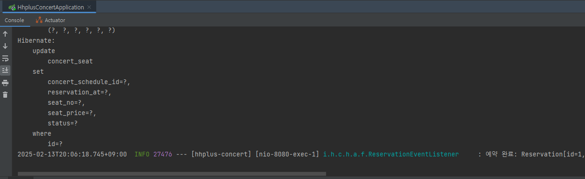

# 🏢 MSA 등장 배경 및 MSA로 전환을 위한 설계

## 개요
- 기존 서비스 구조(모놀리식)에서 문제점은 무엇이었으며, 이를 위한 해결책으로 나온 MSA에 대해 살펴봅니다.
- MSA(Microservices Architecture)로 전환할때, 애플리케이션 이벤트 기반( pub / sub ) 처리에 대해 학습해봅니다.
- 이 과정에서 발생할 수 있는 트랜잭션 처리 문제와 그 해결 방안을 생각해봅니다.

## MSA의 등장 배경
MSA(Microservices Architecture)가 등장하게 된 배경에는 주로 모놀리식 아키텍처의 한계와 소프트웨어 개발 및 배포 방식의 변화입니다.

### 📌 1. 모놀리식 아키텍처의 한계
과거에는 하나의 애플리케이션을 단일 코드베이스로 개발하는 모놀리식 아키텍처가 일반적이었습니다. 하지만 애플리케이션 규모가 커지면서 여러 가지 문제점이 발생했습니다.

1. 배포의 어려움 🛑
- 작은 기능 하나를 수정해도 애플리케이션 전체를 빌드하고 배포해야 했습니다.
- 코드 변경이 많아질수록 배포 시간이 길어지고, 장애 발생 위험이 증가했습니다.

2. 유지보수와 확장성 문제 🔧
- 코드가 방대해지면서 분석이 어려워졌으며, 특정 기능을 수정할 때 다른 기능에도 영향을 미칠 가능성이 높아졌습니다.
- 특정 부분만 확장(Scale)하고 싶어도 전체 시스템을 고려해야 하므로 확장성이 제한되었습니다.

3. 개발 속도의 저하 🐢
- 여러 팀이 동일한 코드베이스에서 작업하면서 충돌이 자주 발생하고 병목현상이 나타났습니다.
- 특정 기능을 담당하는 팀이 독립적으로 개발 및 배포하는 것이 어려웠습니다

### 📌 2. 클라우드와 DevOps의 등장
클라우드 컴퓨팅과 DevOps 문화가 확산되면서, 기존의 모놀리식 방식이 빠른 개발과 배포에 적합하지 않다는 점이 문제로 떠올랐습니다.

1. 클라우드 환경에 최적화된 아키텍처 필요 ☁️
- 클라우드에서는 유연한 확장성(Scalability) 이 중요합니다.
- 기존 모놀리식 구조에서는 특정 부분만 확장하는 것이 어려웠지만, 마이크로서비스는 필요한 서비스만 확장할 수 있습니다.

2. DevOps & CI/CD의 발전 🚀
- 개발과 운영을 자동화하는 CI/CD(Continuous Integration & Continuous Deployment) 가 보편화되면서, 빠른 배포와 롤백이 가능한 구조가 요구되었습니다.
- MSA는 각 서비스 단위로 배포가 가능하여 빠른 개발 주기를 지원할 수 있습니다.

### 📌 3. 대규모 서비스(Netflix, Amazon, Google 등)의 변화
대형 IT 기업들은 이미 MSA 개념을 적용하여 큰 성공을 거두었습니다.

1. 넷플릭스(Netflix) 🎬
- 2008년 AWS 장애로 인해 3일 동안 서비스가 중단되면서, 모놀리식 구조의 문제를 인식하고 MSA로 전환했습니다.
- 이후 각 서비스가 독립적으로 운영되면서 장애에 강하고 확장성이 뛰어난 구조를 구축했습니다.

2. 아마존(Amazon) 🛒
- 2000년대 초반, 아마존은 단일 애플리케이션에서 독립적인 서비스 기반 아키텍처로 전환했습니다.
- 이를 통해 팀별로 독립적인 개발, 배포, 운영이 가능해졌으며, 빠르게 변화하는 시장 요구에 대응할 수 있었습니다.

### ✅ 결론: 왜 MSA가 등장했을까요?
- 모놀리식 아키텍처의 한계로 인해 유지보수, 확장성, 배포 등의 어려움이 커졌습니다.
- 클라우드 & DevOps 환경에서 빠르게 개발하고 배포할 수 있는 아키텍처가 필요해졌습니다.
- Netflix, Amazon과 같은 대기업들이 MSA를 성공적으로 도입하면서 업계 표준이 되었습니다.

즉, 빠른 변화 대응, 독립적 배포, 확장성 극대화라는 목표를 달성하기 위해 MSA가 등장하였고, 현재 널리 사용되고 있습니다.

> 그렇다면, 현재 코드에서 어떻게 설계하며 적용 할 수 있을지 알아보겠습니다.

## 애플리케이션 이벤트 기반 처리 ( pub / sub )
### 현재 시스템 분석
#### 예약 처리

`ReservationFacade.java`
```java
@Component
@RequiredArgsConstructor
public class ReservationFacade {
    private final ConcertService concertService;
    private final ReservationService reservationService;

    // 콘서트 좌석 예약
    // 락획득(파사드) -> 트랜잭션 시작 -> 트랜잭션 커밋 -> 락해제(파사드)
    @DistributedLock(key = "#lockName")
    @Transactional
    public ReservationResult reservation(String lockName, ReservationCommand command) {
        // 콘서트 상태 조회
        ConcertSchedule concertSchedule = concertService.getSchedule(command.scheduleId());
        Seat seat = concertService.getSeat(command.seatId());
        // 예약 가능 상태인지 확인
        concertService.validateReservation(concertSchedule, seat);
        // 좌석 점유
        concertService.assignmentSeat(seat);
        // 예약 정보 저장
        Reservation reservation = reservationService.reserveConcert(concertSchedule, seat, command.userId());
        // 예약 정보 반환
        return ReservationResult.from(reservation, concertSchedule, seat);
    }
}
```

- 위 코드를 살펴보자면, `좌석 점유`, `예약 정보 저장` 이 2가지가 공존해 있는 것을 확인할 수 있습니다.
- 일단 간단한 예제로 예약이 완료되면, 예약이 완료되었다는 것을 알리는 ApplicationEventPublisher를 구현해보겠습니다.

---

### 수정된 예약처리
`ReservationEvent.java`
```java
@Getter
public class ReservationEvent {
    private Reservation reservation;

    public ReservationEvent(Reservation reservation) {
        this.reservation = reservation;
    }
}
```

`ReservationEventListener.java`
```java
@Slf4j
@Component
public class ReservationEventListener {

    @Async
    @TransactionalEventListener(phase = TransactionPhase.AFTER_COMMIT)
    public void handleReservationEvent(ReservationEvent event) {
        log.info("예약 완료: {}", event.getReservation());
    }
}
```

`ReservationFacade.java`
```java
@Component
@RequiredArgsConstructor
public class ReservationFacade {
    private final ConcertService concertService;
    private final ReservationService reservationService;
    private final ApplicationEventPublisher eventPublisher;

    // 콘서트 좌석 예약
    // 락획득(파사드) -> 트랜잭션 시작 -> 트랜잭션 커밋 -> 락해제(파사드)
    @DistributedLock(key = "#lockName")
    @Transactional
    public ReservationResult reservation(String lockName, ReservationCommand command) {
        // 콘서트 상태 조회
        ConcertSchedule concertSchedule = concertService.getSchedule(command.scheduleId());
        Seat seat = concertService.getSeat(command.seatId());
        // 예약 가능 상태인지 확인
        concertService.validateReservation(concertSchedule, seat);
        // 좌석 점유
        concertService.assignmentSeat(seat);
        // 예약 정보 저장
        Reservation reservation = reservationService.reserveConcert(concertSchedule, seat, command.userId());

        // 🔥 예약 이벤트 퍼블리싱
        eventPublisher.publishEvent(new ReservationEvent(reservation));

        // 예약 정보 반환
        return ReservationResult.from(reservation, concertSchedule, seat);
    }
}
```

- 커밋이 정상적으로 이뤄져야지, pub 하도록 설정했습니다.
- 이렇게 처리하게 된다면, 예약 시스템을 처리한것을 알릴 수 있게 됩니다.

`로그 확인`


- 실제 로그를 확인해보면 쿼리가 실행된 이후에 로그가 찍혀있는 것을 확인할 수 있습니다.

### Pub-Sub 패턴이 MSA에서 중요한 이유
- 서비스 간 결합도를 낮춰 유지보수가 쉬워짐
- 비동기 처리로 성능이 향상되고 확장성이 좋아짐
- 하나의 서비스가 장애가 나도 다른 서비스는 영향을 받지 않음
- 새로운 기능을 추가할 때 기존 서비스에 영향을 주지 않음

> 따라서 pub / sub을 활용하게 되면 예약 정보는 완료 되었다는 pub만 신경쓰면 되고 완료된 정보를 가지고 비즈니스 로직을 처리해야 하는 곳들은 sub에만 신경쓰면 되게 됩니다.


## 분산 트랜잭션 에서 문제점
### 결제 처리
1. 결제를 만들고 pub을 했다고 가정하겠습니다.(`Tx1: pub`)
2. 예약을 완료처리를 했습니다.(`Tx2: sub`)
3. 유저의 결제하려고 했으나, 포인트 부족으로 실패했습니다.(`Tx3: sub`)

- 이 경우 다시 1번을 취소 시켜야 하는데 기존과 다르게 하나의 트랜잭션이 아닌 다른 트랜잭션으로 있기에 1, 2 번을 롤백하기 쉽지 않을 것 입니다.

> 이럴 경우를 대비해 Event 기반 보상 트랜잭션을 적용해야 합니다.

### 해결 방안
이러한 문제를 해결하기 위해 Event 기반 보상 트랜잭션(Compensating Transaction)을 적용하는 것이 적절합니다.

1. 보상 이벤트(Compensation Event) 정의
- Tx3(포인트 부족)에서 결제가 실패하면, 이를 감지하여 보상 이벤트(payment.failed)를 발행합니다.

2. 보상 트랜잭션 실행
- Tx1(결제 생성) 및 Tx2(예약 완료)에서 해당 이벤트를 구독하여, 보상 처리를 수행합니다.
- 결제 취소 및 예약 상태를 원래대로 되돌리는 로직을 구현합니다.

3. 비동기 메시징 시스템 활용
- Kafka 또는 RabbitMQ와 같은 메시지 브로커를 사용하여, 트랜잭션 간의 일관성을 유지하면서도 유연한 롤백을 수행할 수 있도록 합니다.
- 이벤트가 정상적으로 소비되지 않은 경우, 재시도(Retry) 및 장애 복구(Dead Letter Queue) 메커니즘을 도입하여 안정성을 보장합니다.

#### 적용 예시
1. Tx3에서 결제 실패 시, "payment.failed" 이벤트를 발행
2. Tx1에서 "payment.failed" 이벤트를 구독하여 결제 데이터 삭제(롤백)
3. Tx2에서 "payment.failed" 이벤트를 구독하여 예약 상태를 원래대로 복구

> 이를 위해서 트랜잭션이 분산되었을 시 하나의 key를 만들고 key를 바탕으로 실패된 Tx가 있다면 모두 보상 트랜잭션이 작동하도록 하는 것이 적절하다고 판단했습니다.

